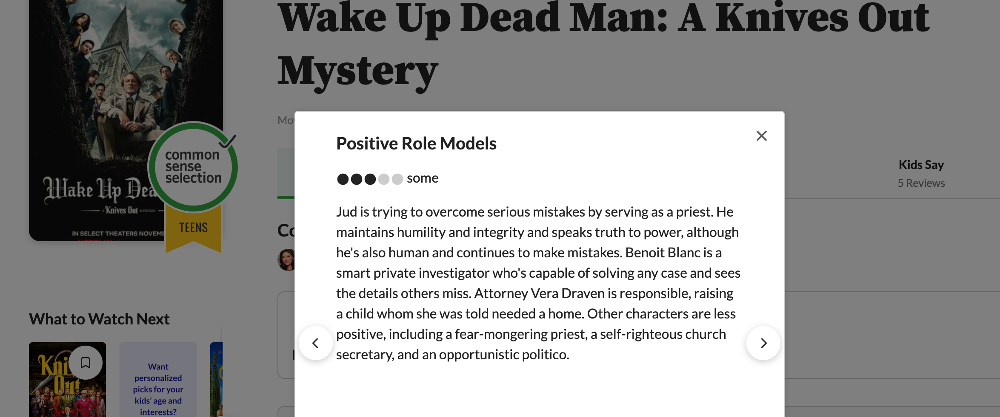
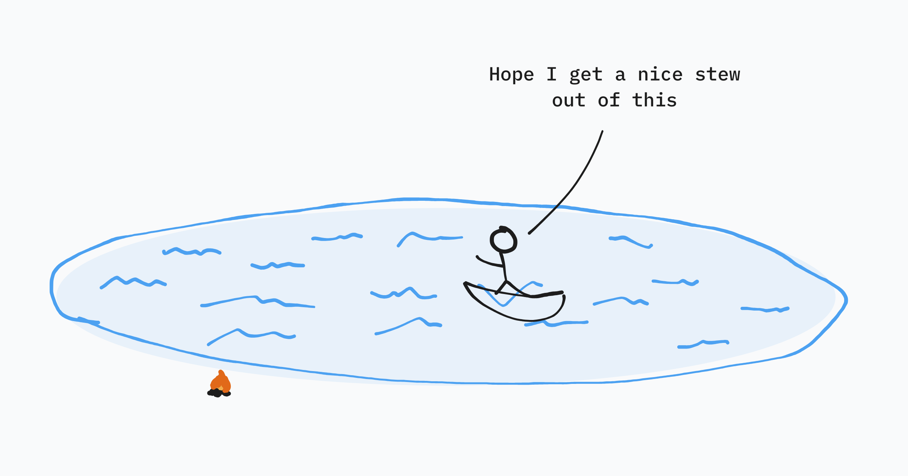
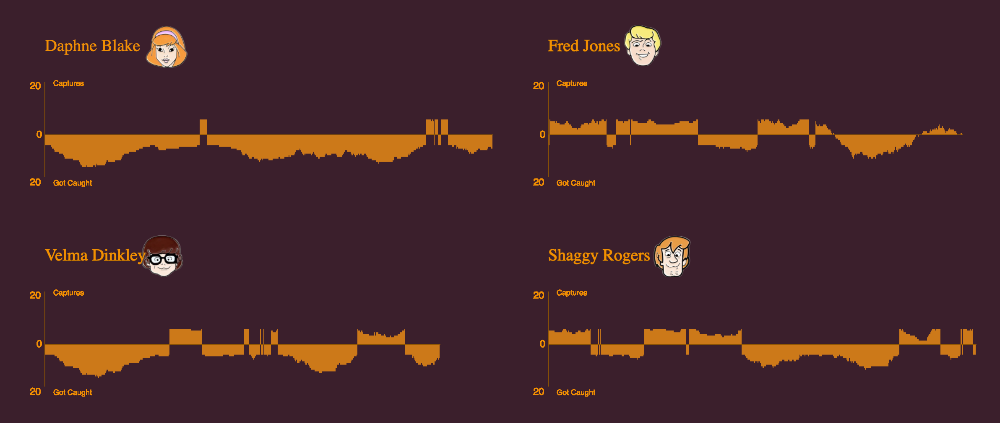
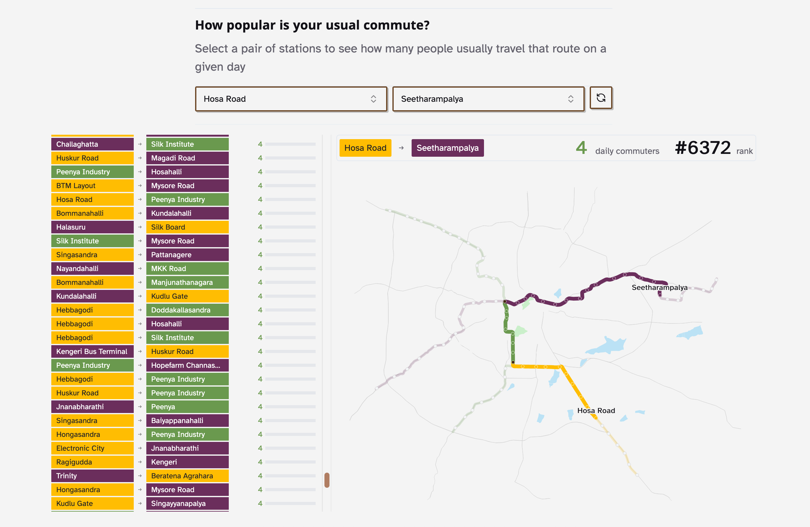
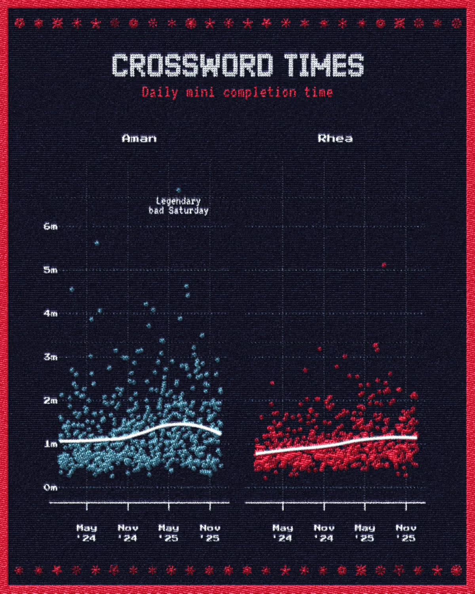
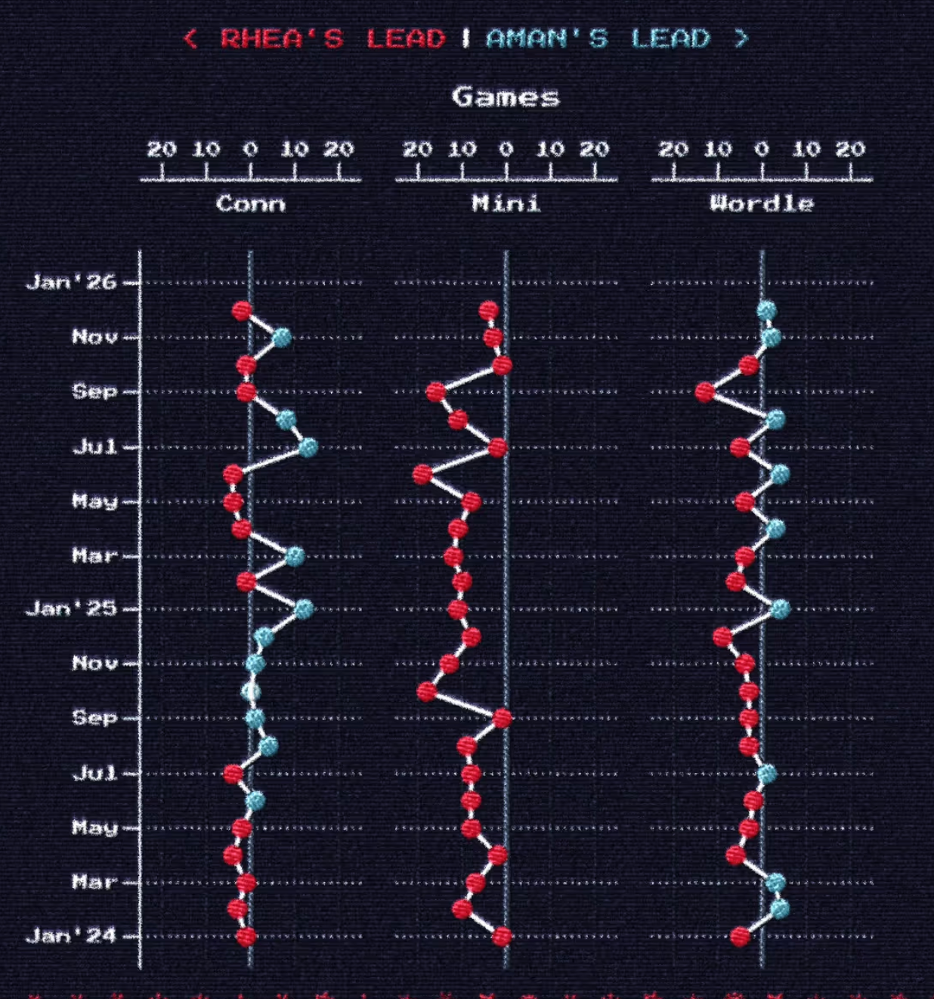
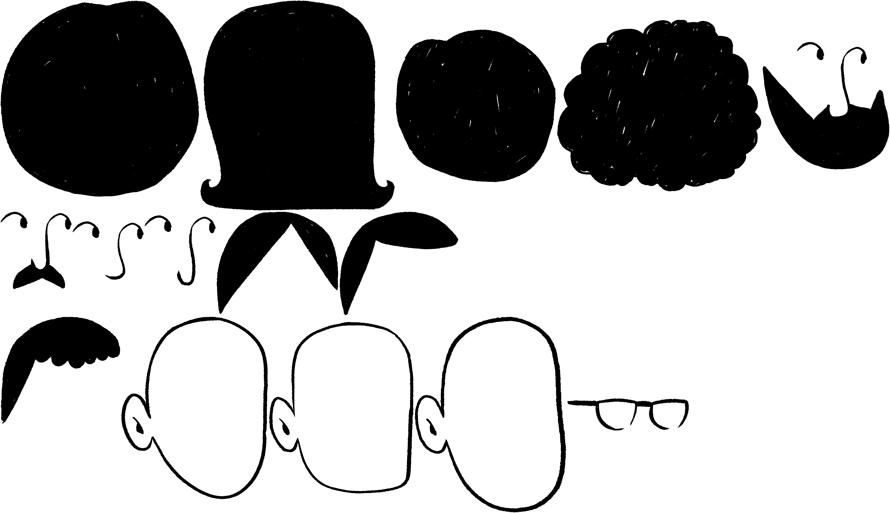
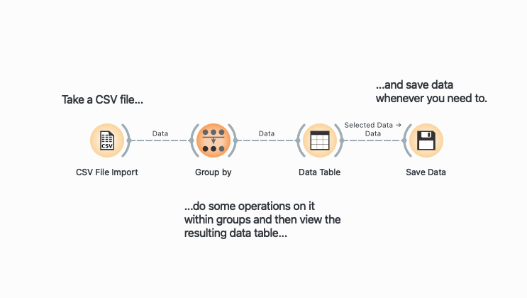
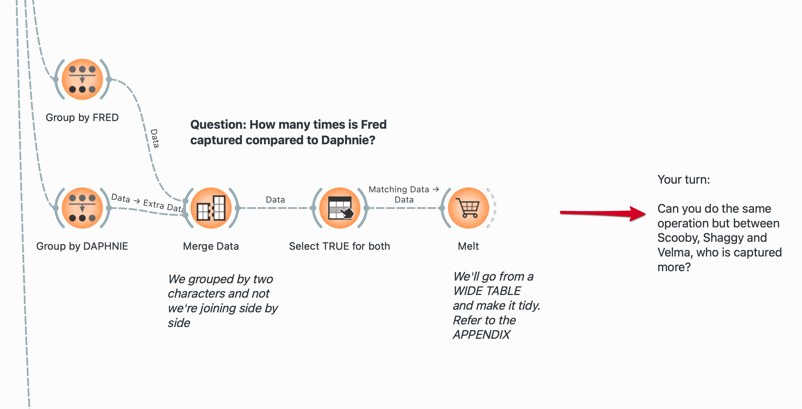

---
format:
  revealjs:
    theme: [default, style.scss]
    width: 1600
    height: 900
    center: true
pagetitle: Data storytelling for the rest of us
execute:
  echo: false
  warning: false
  message: false
revealjs-plugins:
  - pointer
---

## {.title .center}

::: r-fit-text
data storytelling

[for the rest of us]{.flow}
:::


::: notes
Thank you for having me. My name is Aman — it rhymes with "uh-mun," not "ay-man." I want to spend the next thirty minutes convincing you that the hardest parts of data storytelling are not mathematical. They're the things you're already being trained to do here.
:::

---

## { .center}

I am a [designer]{.red}, developer, [indie data-journalist]{.orange}.

. . .

I sit in the middle of all three because I can't give up any of them.

. . .


---

## {background-image="attachments/reuters.jpg" background-size="90%"}

## {.textcenter}


<video autoplay loop muted playsinline>
<source src="attachments/rvl.mp4">
</video>


::: notes
Here's a sample of work I've done across those different contexts — some of it for newsrooms and NGOs, made at RVL.
:::

---

## {.textcenter}

::: r-fit-text
In my free time, I run my own data investigations, where I try

finding questions and answering them

[with data-viz.]{.flow}
:::


::: notes
This is the work I find most alive. No brief, no client, no deadline beyond my own curiosity. I find something I want to understand, figure out what to count, and follow it until it becomes something a reader can engage with.
:::

---

## A few recent examples

---

:::{.textcenter}

Are namesake candidates able to confuse voters in Indian elections?

{.nostretch width="60%" .center}
:::


---

{.textcenter}

---

{.textcenter}

---

## {background-image="attachments/2026-02-25-19-57-24.png" background-size="90%" background-color="#F1E6DC"}


---

## {background-image="attachments/2026-02-25-19-57-01.png" background-size="60%" background-color="#F4EBE3"}


---

{.textcenter .vcenter}

---

{.textcenter .vcenter}

---

## {background-image="attachments/games.png" background-size="cover"}

---

Googling for 'data visualization' is telling...

.png)

---


---


:::: {.columns}

::: {.column width="40%" .center .textcenter}

### Which is okay too!


:::

::: {.column width="60%"}

{width="90%"}

:::

::::

---


:::{.textcenter}

What we miss is thinking of it as a design problem

{width="60%"}

:::

## {.textcenter}

::: r-fit-text
Design thinking applied

to data-visualization is...
:::


::: notes
The coding, the statistics, the spreadsheets — that's maybe 20% of what I do on any project. The other 80% is asking the right question, deciding what to measure, figuring out what the finding means, and choosing the form that reveals it. Those are design decisions. Creative decisions. And they're the decisions no tool can make for you.
:::


# {.title}

::: r-fit-text


[Data Storytelling]{.flow}
:::

::: notes
Let's talk about what "data storytelling" actually means — because it's become a buzzword, and like all buzzwords, it has started to mean several different things at once.
:::


## There are two ways to think about a

`s t o r y`


# {.title .textcenter}

[STORY]{style="font-size: 22vw; font-weight: 900; display: block; text-align: center;"}

A sequence of events. A protagonist. Conflict, resolution.

Novels, films, plays, essays.


## {background-image="attachments/2026-02-25-20-38-23.png" background-position="top"}

# {.title .textcenter}


[story]{style="font-size: 22vw; font-weight: 900; display: block; text-align: center;"}


Something clear to say, in a form that reaches someone.

Whatever that form may be.


::: notes
Cole Nussbaumer Knaflic draws this distinction, and I find it genuinely useful. A capital-S Story is something like a great NYT interactive piece — it has a proper arc, characters, resolution. A lowercase story is something far more achievable: a single chart, a short report, an animation, that makes one thing visible to someone who couldn't see it before. That's the territory we're working in today.
:::


## {background-image="attachments/2026-02-24-19-32-44.png" background-size="contain"}

::: footer
[FT: A new global gender divide is emerging](https://www.ft.com/content/29fd9b5c-2f35-41bf-9d4c-994db4e12998)
:::

::: notes
First example. Explain what this is and why it works as a story.
:::

---

## {background-image="attachments/2026-02-25-17-17-41.png" background-size="50%"}


::: footer
[Not Ship: Last call for third places?](https://www.not-ship.com/last-call-for-third-places/)
:::


---

## {background-image="attachments/spotify.png" background-size="contain"}

::: notes
Spotify Wrapped is worth taking seriously. It turned personal data into an annual ritual — everyone shares it, everyone talks about it. It's an immensely successful data story, and it looks nothing like a dashboard. The data is the same listening logs any streaming platform has. The form is what made it social.
:::

## {.textcenter}

::: r-fit-text
When you think more of the

second kind of [story]{.orange}, a lot of

possibilities open up.
:::

::: notes
I want to show you a few examples that look nothing like what you might expect from "data visualization" — and which are, to me, some of the most exciting data stories made recently.
:::

---

::: textcenter
Big [Stories]{.red} can come together when one has clarity on the smaller [stories]{.orange}

<br/>


:::

## {.textcenter}

::: r-fit-text
Our 'stories' can even live inside the

small, understated dataviz we make
:::

## {.textcenter}

::: r-fit-text
Butttt, not every viz is a story.
:::

. . .

The data storytelling process has two distinct phases:

[exploration]{.orange} and [explanation.]{.red}

. . .

<br/>
Sometimes we mistake showing readers our exploration

when they came for an explanation.

::: notes
Exploration is the process of turning over a hundred rocks to find one or two interesting ones. Explanation is when you bring those two rocks to your reader and say: look at this. The mistake I made constantly when I was learning: I would show readers all hundred rocks. I was proud of the work. I wanted them to see it. But what they saw was a pile of rocks, not a story.
:::

## {.textcenter}


## {.textcenter}

::: {.column-screen-inset-shaded style="position: relative; width: 100%; margin: auto;"}




:::

## {.textcenter}


## {.textcenter}


## {background-image="attachments/2026-02-24-20-02-49.png" background-size="contain" background-color="#D8D4CB"}

::: notes
Here's a more recent chart analyzing how repetitive each song in Taylor Swift's albums is. Visually, much better. But I want you to ask yourself: what do I want you to take away from this? Honestly, at this stage, I wasn't totally sure. The chart is interesting. But it doesn't have a point of view yet.
:::

## {.textcenter}

::: r-fit-text
[Okay, and?]{.orange}

:::

What do I want you to take away?

::: notes
"Okay, and?" is the most useful question you can ask of your own work. It forces you to name the point. If you can't answer it with a single clear sentence, you have an exploration, not an explanation. The work of synthesis is converting one into the other — and that conversion requires a creative decision, not a statistical one.
:::

## {background-image="attachments/2026-02-24-21-03-21.png" background-size="contain" background-color="#85827C"}

:::{style="background-color: rgba(255, 255, 255, 0.85); border: 2px solid #333; border-radius: 10px; padding: 12px 25px; max-width: fit-content; font-size: 26px;"}

As Swift moved into mainstream pop to write catchy songs,

her lyrics naturally became more repetitive...
:::


---

## A story reduces exploration until [it fits in a sentence.]{.orange}

<br/>

What did _you_ see?

How would you want to tell me about it?


::: notes
The "aha" in a data story doesn't come from the math or the chart. It comes from the moment a reader recognizes something human inside the abstraction. That's a writer's job. A designer's job. Steinbeck said this about fiction, but it applies completely to data. If your story isn't about the person reading it, they will not listen. The data is just the mechanism by which you connect a question to a shared human experience.
:::


# {.title}

::: r-fit-text
Making a
['story']{.flow}
:::


# {.title}

::: r-fit-text
[1. Call to Action]{.flow}
:::

::: notes
The first move is not opening a spreadsheet. It's finding the itch — the thing you want to know badly enough to spend a week figuring out how to measure.
:::

---

## A call to action can come from anywhere.


1. Curiosity about something you read
2. An argument you want to win
3. A shared joke
5. Assignments (welp)

. . .

At its worst, it's interesting only to you, which is still a win.

. . .

At its best, it's a relatable hook that someone would spend time on.

::: notes
I want to be honest about this. Not every project needs to be about electoral fraud or climate change. Some of my best work came from petty personal competitions. The R skills I now use for serious civic journalism came directly from wanting to prove that I beat my partner at Wordle more often than she admits. The obsession came first. The tool came because the obsession demanded it. That is always the right order.
:::

---

## {background-color="#171717"}

:::: {.columns}

::: {.column width="40%"}

Something looked odd in the data, which lead me to read about cases that were reported in the news


:::

::: {.column width="60%"}

{width="90%"}

:::

::::

## Call to actions become questions {background-color="#0B141A"}

<br/>

:::: {.columns}

::: {.column width="50%"}

::: {.fragment fragment-index=1}
How many times has it happened?
:::

::: {.fragment fragment-index=3}
How often does it confuse people?
:::

::: {.fragment fragment-index=5}
What are noteworthy instances?
:::

:::

::: {.column width="50%" style="opacity: 60%;"}

::: {.fragment fragment-index=2}
→  _Counting occurrences_
:::

::: {.fragment fragment-index=4}
→  _Average votes taken by namesakes_
:::

::: {.fragment fragment-index=6}
→  _Extreme examples of small vote margins_
:::

:::

::::

## {.textcenter}


---

## {.textcenter}


::: notes
Here's how I visualize this depth of questioning. The surface of the question is countable and specific — that's what gets you into the data. The layer beneath is the one that makes readers feel something. You need both. The specificity gives you the data; the depth gives you the story.
:::

---

## {.textcenter}

Without a guiding question things can get tedious...



##

::: r-fit-text
I am curious about [*[Topic]*]{.orange},

so I will measure [*[Data]*]{.red}

to see if [*[Hypothesis]*]{.grey} is true.
:::

::: footer

Adapted from [Andrew Duckworth](https://grillopress.github.io/2018/12/19/trying-a-new-format-for-hypotheses.html)

:::

::: notes

"I am curious about [Topic], so I will measure [Data] to see if [Hypothesis] is true.
:::


# {.title}

::: r-fit-text
[2. Analysis]{.flow}
:::

::: notes
You have a question. You have a measurement. Now you need to find something in the data. This is the part that scares creative people most, and I want to be direct: it shouldn't. The math here is simpler than anything you've done in a single design course.
:::


## Arriving at interesting insights can take as little as [four operations.]{.orange}

::: {.incremental}
1. **Count** - How many?
2. **Filter** - Which ones?
3. **Sort** - What's biggest or smallest?
4. **Group** - How do categories compare?
:::

---

And these can be **composed**, meaning you can combine them:

1. First filter for something
2. Group it into categories
3. Count items within categories

---

## Simple (but shocking) example

:::: {.columns}

::: {.column width="40%"}


{width="200px"}

[Someone catalogued 603 episodes of Scooby Doo](https://github.com/rfordatascience/tidytuesday/tree/main/data/2021/2021-07-13), let's count how many times Daphne catches a monster...

:::

::: {.column width="60%" .fragment .center}

<br/>
<br/>

```{r}
library(tidyverse)
library(knitr)
library(tidyverse)

tuesdata <- tidytuesdayR::tt_load('2021-07-13')

scoobydoo <- tuesdata$scoobydoo
scoobydoo %>%
  mutate(total_episodes = n()) %>%
  filter(caught_daphnie == "TRUE") %>%
  summarize(
    "caught_by_daphne" = n(),
    "total_episodes" = first(total_episodes)
  ) %>%
  kable()
```


:::

::::


::: notes
Edward Tufte wrote that the fundamental analytical act in all of statistics is answering one question: "Compared with what?" These four operations are all in service of that single question. Counting alone gives you a number. Counting compared to something gives you a finding. Everything else — regressions, machine learning, Bayesian inference — is built on top of these four operations. You don't need the rest to tell a good story.
:::

---

## {background-color="#3B1F2C"}



---

## Largest, Smallest, Most, Least...{background-color="#F4F4F4"}

<br/>


::: footer
[How Bangalore Uses The Metro](https://diagramchasing.fun/2025/how-bangalore-uses-the-metro)
:::

---

## {.textcenter}

::: r-fit-text
If nothing interesting appears,

that's a signal to [revisit the question]{.orange},

not to run fancier statistics.
:::

::: notes
This is something I had to learn the hard way. When analysis returns nothing, the instinct is to go deeper into the math — to try a more sophisticated technique. That's almost never the right move. Usually it means the question wasn't specific enough, or the proxy wasn't a good approximation of the concept. The exit from a dead end is backwards, not forwards.
:::

# {.title}

::: r-fit-text
[3. Synthesis]{.flow}
:::

::: notes
You've asked a question, built a measurement, run your four operations. Now you have findings. Synthesis is two moves: declare what you found, and choose the form that reveals it.
:::


---


---


---

## {.textcenter}




## {.pullquote}

> *"If a story is not about the hearer he will not listen... The strange and foreign is not interesting — only the deeply personal and familiar"*
>
> — John Steinbeck, *East of Eden*

---

## Your findings tend to take one of four shapes


::: {.incremental}
- **Normals** - Describe what "typical" looks like
- **Comparison** - How does one count compare to another?
- **Trends** - Are things going up, going down, staying the same?
- **Exceptions** - What's surprising? Some outliers?
:::

---


::: footer

[The Dataviz Project](https://datavizproject.com/#)
:::


---



---




::: notes
This is the bridge between analysis and design, and it's where your design training fully activates. If your finding is a comparison, you probably want a bar chart or a slope chart. If it's a trend, you want a line. If it's an exception, you want to isolate the outlier and make it impossible to miss. You are not just reporting — you are choosing the form that will make the finding legible to someone who wasn't in your spreadsheet with you.
:::

---

:::: {.columns}

::: {.column width="50%"}

We might not even restrict ourselves to charts.

<br/>

In our election story, we found one election where a ballot had the most number of namesake candidates...

:::

::: {.column width="50%" .fragment}

| |
|---|
| CHANDU LAL SAHU |
| CHANDU LAL SAHU |
| CHANDU LAL SAHU |
| CHANDU LAL SAHU |
| CHANDU LAL SAHU |
| <span style="background-color: #90EE90; display: block;">CHANDU LAL SAHU</span> |
| CHANDOO LAL SAHU |
| CHANDU RAM SAHU |
| CHANDU LAL SAHU |
| CHANDURAM SAHU |
| CHANDU RAM SAHU |
| CHANDU LAL SAHU |

:::

::::
---

:::: {.columns}

::: {.column width="50%"}

{width="74%"}

:::

::: {.column width="50%"}

{width="80%"}

:::

::::

---


## {background-iframe="https://diagramchasing.fun/2024/votes-in-a-name"}

## {.textcenter background-color="#FFFEFF"}


---

I had also calculated a number for how similar two names are.

<br/>

::: {.r-fit-text}

| Names | Similarity | [Face]{style="color: #F8FBF8;"} | [Face]{style="color: #F8FBF8;"} |
|:---|:---:|:---:|:---:|
| [Aman / Raman]{.fragment fragment-index=1} | [[0.9]{.orange}]{.fragment fragment-index=1} | [{height="1.5em" style="vertical-align: middle;"}]{.fragment fragment-index=1} | [{height="1.5em" style="vertical-align: middle;"}]{.fragment fragment-index=1} |
| [Aman / John]{.fragment fragment-index=2} | [[0.0]{.red}]{.fragment fragment-index=2} | [{height="1.5em" style="vertical-align: middle;"}]{.fragment fragment-index=2} | [{height="1.5em" style="vertical-align: middle;"}]{.fragment fragment-index=2} |

:::

---

## {.textcenter background-color="#fff"}



## {.textcenter background-color="#FFFEFF"}


## Don't restrict yourself! Use the right-side of your brain all you want

::: {.incremental}
- Animations
- Illustration and hand-drawn visuals
- Interactive experiences
- Scrollytelling
- Sound and audio
- Whatever form best serves the feeling
:::

. . .

The form is the last decision, and it is [entirely yours.]{.orange}

::: notes
This is where your specific training becomes your greatest advantage. An animator knows how to guide attention through time. A game designer knows how to make someone want to keep clicking — to feel agency inside a system. A UX designer knows how to reduce friction between a person and understanding. These are not soft skills applied to hard data. They are exactly the skills that determine whether anyone actually encounters the finding you worked so hard to produce.
:::


# {.title}

::: r-fit-text
[Going beyond your course]{.flow}
:::

::: notes
I want to spend the last few minutes on a practical question: how do you actually get better at this? Not in theory — concretely, starting this week.
:::

---

## {.textcenter}

::: r-fit-text
Pick the tool that removes the most

[friction between you and the question.]{.orange}
:::

::: notes
The tool is not the point. The question is the point. But the wrong tool — one you're fighting against, one that requires ten steps to do something simple — will drain your energy before you get to the part that matters. Pick the tool that gets you to your answer the fastest, even if it's not the most powerful available. Upgrade when the question demands it.
:::

---

## The tools exist at every level of the stack.

## Excel with The Pudding {.textcenter}


::: footer

[How to recreate our charts without code](https://pudding.cool/process/no-code-charts/)
:::

::: notes
The Pudding has produced a series of tutorials that recreate their famous data analyses entirely in Excel — no code required. These are excellent. They show you the four operations in action on real data from projects you've probably read. If you're already working in Excel and Power BI, this is your on-ramp into data storytelling methodology without learning any new tools.
:::

---

## Orange Data Mining {.textcenter}



::: notes
Orange is a drag-and-drop data mining tool with a visual node-based interface. You connect operations and watch what happens to your data without writing a single line. For visual thinkers, it's a much more intuitive way to understand what statistical operations are actually doing to your data.
:::

---

##  {.textcenter}


##  {.textcenter}




::: notes
I'll say something that surprised me when I discovered it: R changed my life. Not because it made me a statistician, but because David Robinson's live screencast series showed me someone reasoning through a dataset in real time — asking questions, trying things, hitting dead ends, revising. It demystified the analytical process more than any course I've taken. If you want to try R, start with his screencasts. Not a textbook.
:::

---

## Consume a lot. Tinker constantly.

<br/>

::: {.columns}

::: {.column .fragment width="30%"}
### Read
The Pudding, Flowing Data, Nightingale (DVS), Newsrooms
:::

::: {.column .fragment width="30%"}
### Practice
**Tidy Tuesday** is a weekly shared dataset, usable in any tool
:::

::: {.column .fragment width="30%"}
### Make
Pick a personal data project. Challenge a new method, form, or tool.
:::

:::

::: notes
The pottery parable from *Art & Fear*: the class told to make the most pots made better pots than the class told to make the best pot. Frequency beats perfection. Every week you spend thirty minutes on a Tidy Tuesday dataset is worth more than a month of planning the perfect project. Small, consistent, personal work compounds faster than you expect.
:::


# {.title}

::: r-fit-text
You don't have to become

['data people.']{.flow}
:::

::: notes
I want to end with this, because I think it's the most important thing I can say to this room.
:::

---

## {.textcenter}

::: r-fit-text
*"I consider myself to be a*

*[professional question asker.]{.orange}"*
:::

— Amber Thomas, The Pudding

