---
format:
  revealjs:
    theme: [default, style.scss]
    width: 1600
    height: 900
    center: true
pagetitle: Data storytelling for the rest of us
execute:
  echo: false
  warning: false
  message: false
revealjs-plugins:
  - pointer-sync
---

## {.title .center}

::: r-fit-text
data storytelling

[in lowercase]{.flow}
:::

::: notes
Thank you for having me. My name is Aman, it rhymes with "uh-mun." I'll be talking about what 'data storytelling' means to me and what it looks like in my process.
:::

---

## { .center}

I am a [designer]{.red}, developer, [indie data-journalist]{.orange}.

I sit in the middle of all three because I can't give up any of them.

. . .


::: notes
So I'm three things. I'm a designer because that's what I studied. I'm a developer because that's my hobby and also my day job. And I call myself an indie data journalist, which is where my real passion lives.
:::

---

## {background-image="attachments/reuters.jpg" background-size="90%"}

::: notes
This is work from my time at Reuters as a graphics intern. Hurricanes in Florida, flooding in Pakistan, elections. Basically working with reporters to put visuals on the news.
:::

## {.textcenter}

<video autoplay loop muted playsinline>
<source src="attachments/rvl.mp4">
</video>

::: notes
At Revisual Labs it's similar but for clients; interactive stories, maps, dashboards. For projects in India, sometimes in Ukraine, sometimes in East Africa. That's the client work.
:::

---

## {.textcenter}

::: r-fit-text
In my free time, I run my own data investigations, where I try

finding questions and answering them

[with data-viz.]{.flow}
:::

::: notes
But what really makes me feel alive is when I have no brief, no client, no deadline except my own curiosity. I find a question I want to understand, figure out what to measure, and follow it until it becomes something a reader can engage with.
:::

---

:::{.textcenter}

Are namesake candidates able to confuse voters in Indian elections?

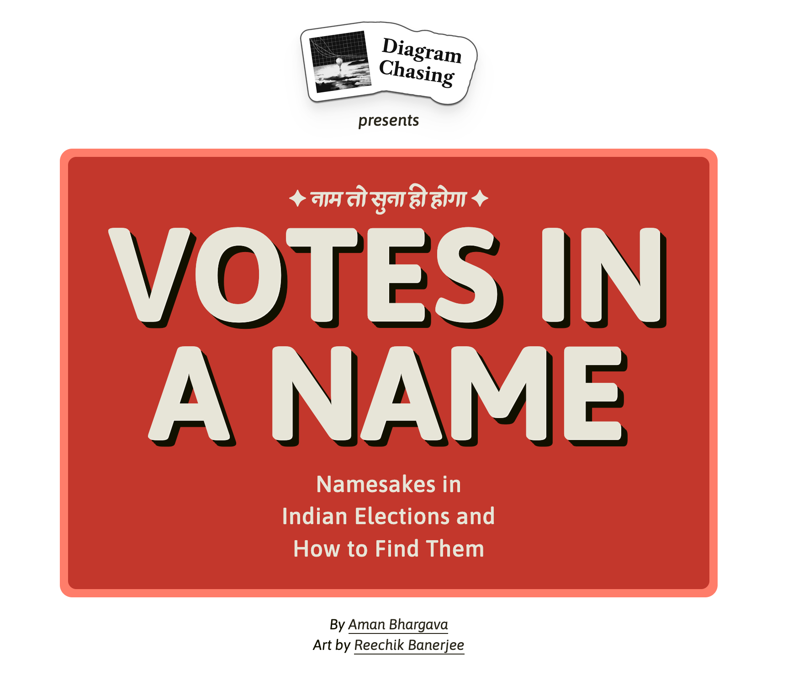{.nostretch width="60%" .center}
:::

::: notes
One project I'll keep coming back to today is called 'Votes in a Name'. In India, during elections, parties from both sides try to confuse voters by placing similar-sounding candidates in the same race to split the vote. I didn't know this was a thing. Then a friend explained it to me, I started reading about it, and I couldn't find anyone who'd actually measured how often it happens.
:::

---

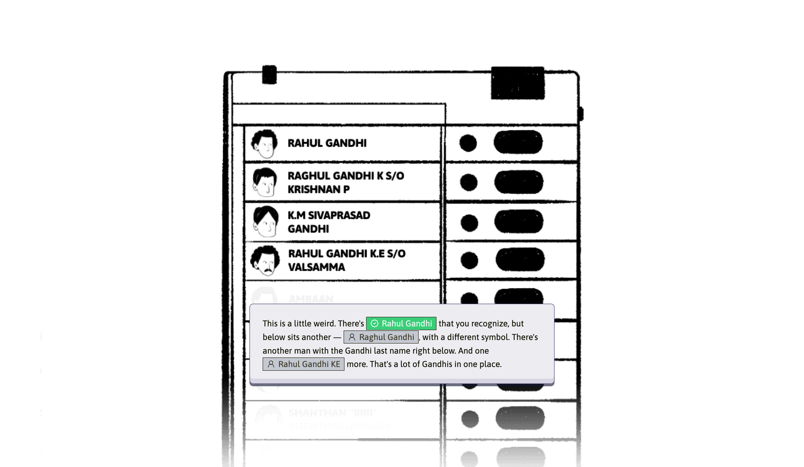{.textcenter}

::: notes
A clear example is this one. There's a candidate called Rahul Gandhi who is the legitimate candidate. And he's surrounded by namesakes. Some KM Gandhi, this Gandhi, that Gandhi. Educated people might scoff at this.
:::

---

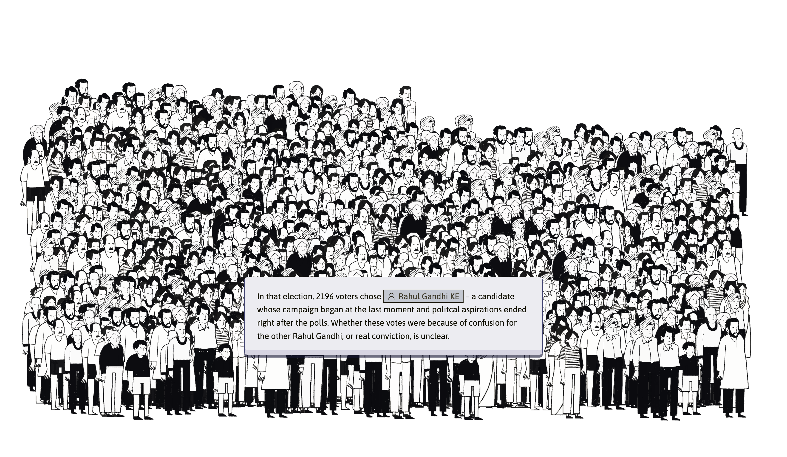{.textcenter}

::: notes
But in that particular election, almost 2,000 people voted for the wrong Rahul Gandhi. So it's a real problem. And I found it genuinely amusing to dig into. These are some of the outputs from that investigation and we'll come back to how this was made later in the talk.
:::

---

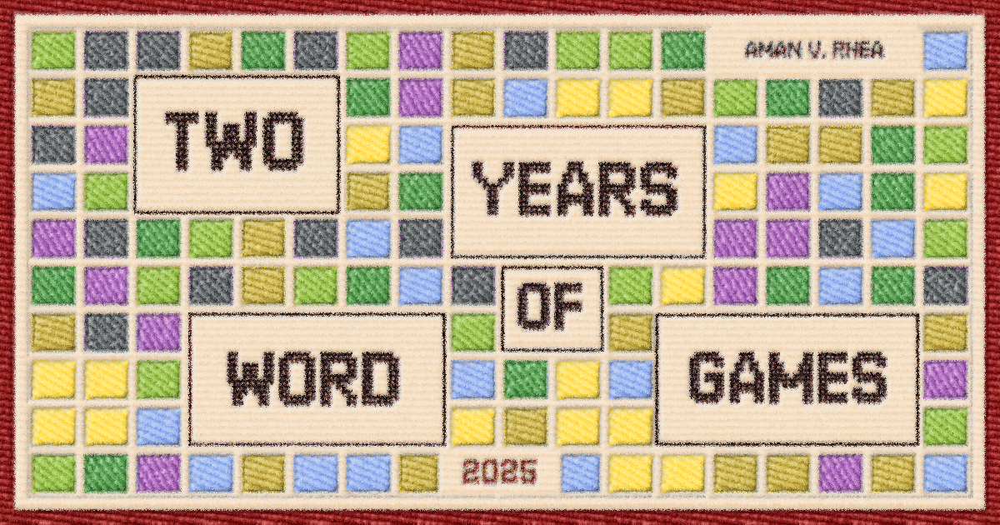{.textcenter .vcenter}

::: notes
Then I also do this just for fun. Me and Rhea play the NYT word games every single day, Wordle, Connections, the Crossword. For the past two years we've been tracking our results.
:::

---

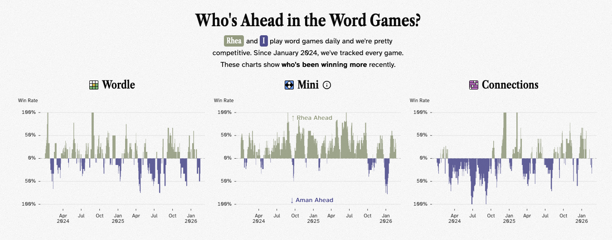{.textcenter .vcenter}

::: notes
There's a live tracker on my website that updates daily. Everyone can see she is absolutely whooping my butt and tells the story of how badly I'm losing.

But anyway, this is the stuff that I'm doing _now_.
:::

---

Googling for 'data visualization' is telling...

.png)

::: notes
When I was in college and just getting into this, I learnt more or less the same process that you see here: collect data, prepare it, clean it, visualize it, put it in a report or a dashboard. This is not wrong and at that stage, even learning how to make charts is intimidating. This gets you making those quickly.
:::

---

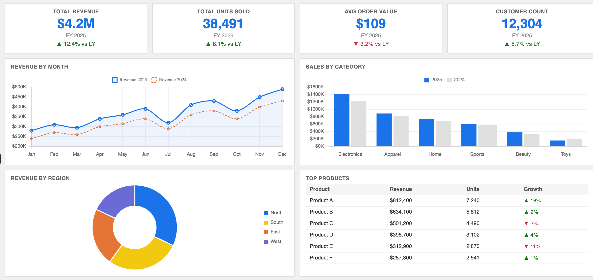

::: notes
And this is where you end up; a bar chart here, a pie chart there, a fairly ordinary dashboard. Which is fine. But I think we can do better.
:::

---

:::: {.columns}

::: {.column width="40%" .center .textcenter}

### Which is okay too!
:::

::: {.column width="60%"}
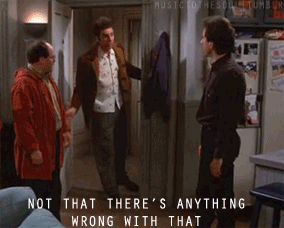{width="90%"}
:::
::::

::: notes
I'm not here to make you feel bad about dashboards. They're genuinely useful where they are used, but for us I don't think they have to be the endpoint.
:::

---


:::{.textcenter}

What we miss is thinking of it as a design problem
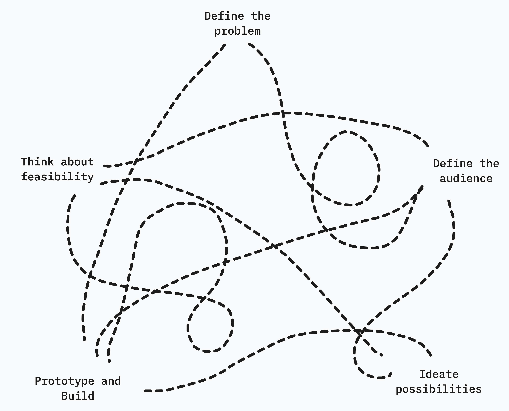{width="60%"}
:::

::: notes
I think a lot of you come from design and other creative disciplines. In design, we're taught something like this: define the problem, think about who you're making it for, ideate, prototype, iterate. And crucially, it's not linear. The prototype can change the audience. The feasibility can change the idea. We kind of lose that when we learn data visualization as a sequence of steps.
:::

## {.textcenter}

::: r-fit-text
Design thinking applied

to data-visualization is...
:::

::: notes
When you apply design thinking to data, you get data storytelling. It's a buzzword now, like "insights," you can just throw it around. So I think it's worth being specific about what kind of storytelling we're actually talking about.
:::

# {.title}

::: r-fit-text
[Data Storytelling]{.flow}
:::

::: notes
There are two ways to think about a story. And the distinction matters a lot for how intimidating this feels.
:::

# {.title .textcenter}

[STORY]{style="font-size: 22vw; font-weight: 900; display: block; text-align: center;"}

A sequence of events. A protagonist. Conflict, resolution.

Novels, films, plays, essays.

::: notes
The first is the capital-S Story. This is what most frameworks are talking about. A sequence of events, a protagonist, conflict, resolution. Novels, films, essays. A traditional narrative arc.
:::

## {background-image="attachments/2026-02-25-20-38-23.png" background-position="top"}

::: notes
And you've probably heard about The Pudding, who do this brilliantly. When I was in college and I looked at their work, I felt completely overwhelmed. How do I get from my small charts to this? It used to scare me.
:::

# {.title .textcenter}


[story]{style="font-size: 22vw; font-weight: 900; display: block; text-align: center;"}

Something clear to say, in a form that reaches someone.

Whatever that form may be.

::: notes
But there's also the lowercase story. And I think this is where most of us are actually working. I define it as having something specific and clear to say, in a form that can reach someone. The output doesn't need a grand arc. It just needs a solid point of view.
:::

## {background-image="attachments/2026-02-24-19-32-44.png" background-size="contain"}

::: footer
[FT: A new global gender divide is emerging](https://www.ft.com/content/29fd9b5c-2f35-41bf-9d4c-994db4e12998)
:::

::: notes
This chart by John Burn-Murdoch is a good example. It's about how political ideologies are diverging between men and women across the world. But this chart which is a fairly simple set of graphics with just a strong headline feels complete to me. I know what he wants me to see. I know something I didn't know before. That's a story.
:::
---

## {background-image="attachments/2026-02-25-17-17-41.png" background-size="50%"}

::: footer
[Not Ship: Last call for third places?](https://www.not-ship.com/last-call-for-third-places/)
:::

::: notes
Someone writing about how third spaces were actually rising before the pandemic, then declined after. Very simple charts. What does the heavy lifting is the annotations and the headline. It contains everything I need to know about what this person wanted me to understand.
:::

---

## {background-image="attachments/spotify.png" background-size="contain"}

::: notes
And then there's this. Spotify Wrapped isn't even charts. But everybody looks forward to it. It's a data experience, presented in an incredibly intentional way. This is data storytelling too. And I think it's worth taking seriously as an example.
:::

## {.textcenter}

::: r-fit-text
When you think more of the

second kind of [story]{.orange}, a lot of

possibilities open up.
:::
::: footer
[so, what? By Cole Nussbaumer Knaflic](www.storytellingwithdata.com/blog/2017/3/22/so-what)
:::

::: notes
When you start thinking in lowercase stories, two things happen. First, a lot more possibilities open up because the form is your choice. Second, it actually feels attainable. I can make something like Spotify Wrapped. I might not be able to make The Pudding just yet, but I can curate something intentional and specific.
:::

---

::: textcenter
Big [Stories]{.red} can come together when one has clarity on the smaller [stories]{.orange}

<br/>
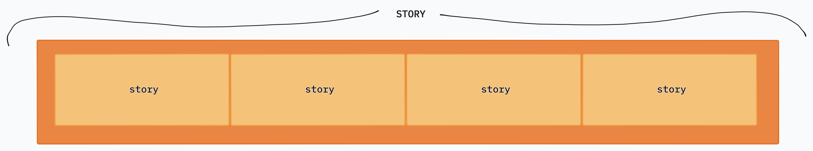
:::

::: notes
And once you nail your small stories, your small charts with a clear point of view, you can start assembling them into something larger. The lowercase story is not a consolation prize.
:::

## {.textcenter}

::: r-fit-text
Our 'stories' can even live inside the

small, understated dataviz we make
:::

::: notes
This applies to the small everyday charts we make, for assignments, for clients, for fun. The story can live inside something very simple. But only if you've committed to what it's about.
:::

## {.textcenter}

::: r-fit-text
Butttt, not every viz is a story.
:::

. . .

The data storytelling process has two distinct phases:

[exploration]{.orange} and [explanation.]{.red}

. . .

<br/>
Sometimes we mistake showing readers our exploration

when they came for an explanation.

::: notes
But, and this is important, not every visualization is a story. The data storytelling process has two distinct phases: exploration and explanation. Exploration is what you do for yourself. Explanation is what the reader is expecting when they engage with your work. The mistake I made constantly when I was learning was showing readers my exploration when they came for an explanation. I was proud of the work. I wanted them to see all of it. But what they saw was a pile of rocks, not a story.
:::

## {.textcenter}

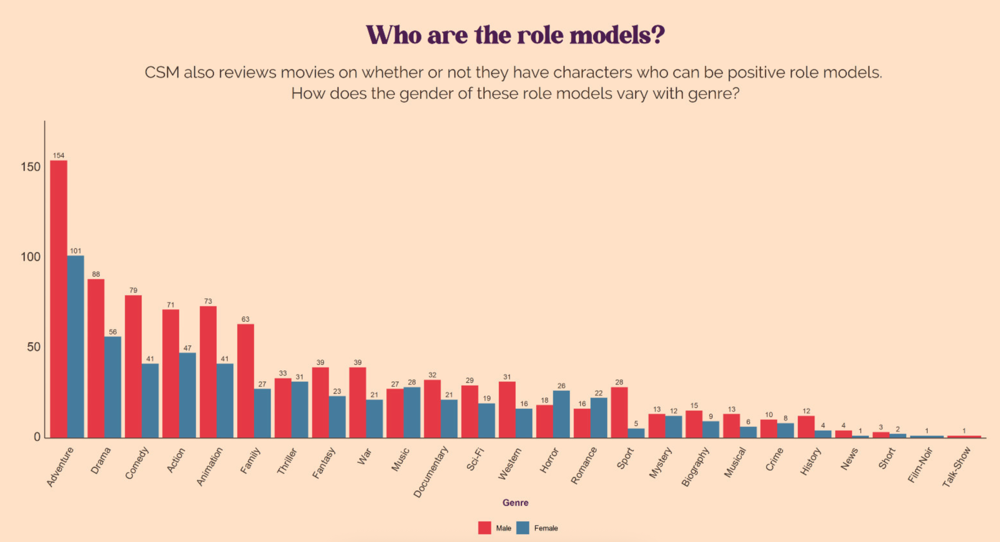

::: notes
Here's an early example of mine. This is from Common Sense Media, they review movies for parents and one of the things they do is tag characters as positive or negative role models. Red is male, blue is female. There are a lot of design problems here.
:::

## {.textcenter}
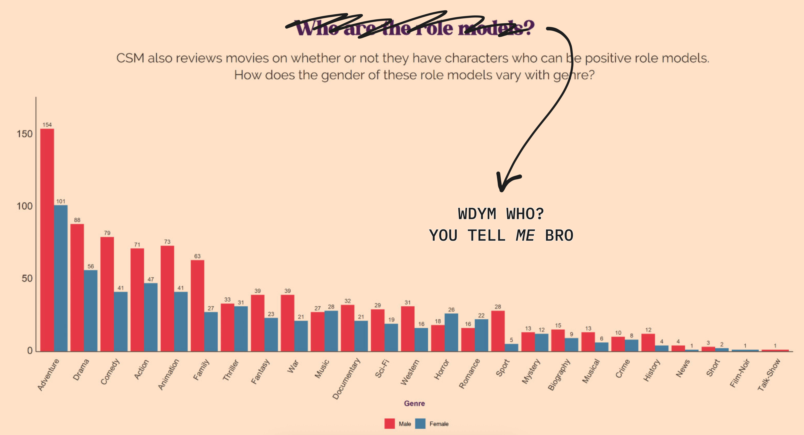

::: notes
But looking back, the bigger problem is that I never committed to saying what I noticed. There's a clear pattern, but I asked the reader to find it themselves instead of just telling them.
:::

## {background-image="attachments/2026-02-24-20-02-49.png" background-size="contain" background-color="#D8D4CB"}

::: notes
This is more recent where I was analyzing how repetitive each Taylor Swift album is. Better design, better color, annotations. But the same problem. If you're not a Taylor Swift fan, your first question is: so what? And the thing is I can answer it! But for some reason I didn't
:::

## {.textcenter}

::: r-fit-text
[Okay, and?]{.orange}
:::

What do I want you to take away?

::: footer
[so, what? By Cole Nussbaumer Knaflic](www.storytellingwithdata.com/blog/2017/3/22/so-what)
:::

::: notes
"Okay, and?" is the most useful question you can ask of your own work. If you can't answer it with a single clear sentence, what is the point of this, what do you want me to take away, you have an exploration, not an explanation. The synthesis is converting one into the other.
:::

## {background-image="attachments/2026-02-24-21-03-21.png" background-size="contain" background-color="#85827C"}

:::{style="background-color: rgba(255, 255, 255, 0.85); border: 2px solid #333; border-radius: 10px; padding: 12px 25px; max-width: fit-content; font-size: 26px;"}
As Swift moved into mainstream pop to write catchy songs,

her lyrics naturally became more repetitive...
:::

::: notes
The answer here isn't complicated. As Taylor Swift moved into more mainstream pop to write catchy songs, her lyrics naturally became more repetitive, that's just the nature of those songs. That's it. I just needed to say it. I just didn't commit to it.
:::

---

## A story reduces exploration until [it fits in a sentence.]{.orange}

<br/>

What did _you_ see?

How would you want to tell me about it?

::: notes
A story becomes an explanation when you can fit it into one sentence. What did you see? How would you want to tell me about it? That's the whole question.
:::

# {.title}

::: r-fit-text
Making a
['story']{.flow}
:::

::: notes
So let's talk about actually making one. I'll walk through the process I use, using the election project as the running example.
:::

# {.title}

::: r-fit-text
[1. Call to Action]{.flow}
:::

::: notes
The first step is finding the thing you want to know badly enough to spend a week measuring. This is not opening a spreadsheet. This is finding the itch.
:::

---

## A call to action can come from anywhere.


1. Curiosity about something you read
2. An argument you want to win
3. A shared joke
5. Assignments (welp)

. . .

At its worst, it's interesting only to you, which is still a win.

. . .

At its best, it's a relatable hook that someone would spend time on.

::: notes
It can come from something you read, an argument you want to win, a shared joke, or yes, an assignment. At its worst, it's interesting only to you, which is still a win, because if you care about what you're visualizing, you'll have something to say about it. At its best, it's a hook someone else would spend time on. It's worth thinking about this phase intentionally.
:::

---

## {background-color="#171717"}

:::: {.columns}
::: {.column width="40%"}
Something looked odd in the data, which lead me to read about cases that were reported in the news
:::
::: {.column width="60%"}
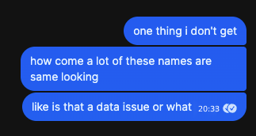{width="90%"}
:::
::::

::: notes
For the election project, it started with a conversation. I noticed names looking similar in some data I was poking at. My friend said, yeah, this is actually a known thing. I started reading about it in the news. And I couldn't find anyone who'd measured how often it happens. That gap became the call to action.
:::


## Call to actions become questions {background-color="#0B141A"}

<br/>

:::: {.columns}
::: {.column width="50%"}
::: {.fragment fragment-index=1}
How many times has it happened?
:::
::: {.fragment fragment-index=3}
How often does it confuse people?
:::
::: {.fragment fragment-index=5}
What are noteworthy instances?
:::
:::
::: {.column width="50%" style="opacity: 60%;"}
::: {.fragment fragment-index=2}
→  _Counting occurrences_
:::
::: {.fragment fragment-index=4}
→  _Average votes taken by namesakes_
:::
::: {.fragment fragment-index=6}
→  _Extreme examples of small vote margins_
:::
:::
::::

::: notes
A call to action then becomes a set of measurable questions. How many times has this happened? That's countable. How often does it confuse people? That's vague, so I translate it into something I can measure, like the average number of votes taken by namesake candidates. What are the noteworthy instances? That becomes: filter for the extreme cases where the margin was the smallest.
:::


## {.textcenter}

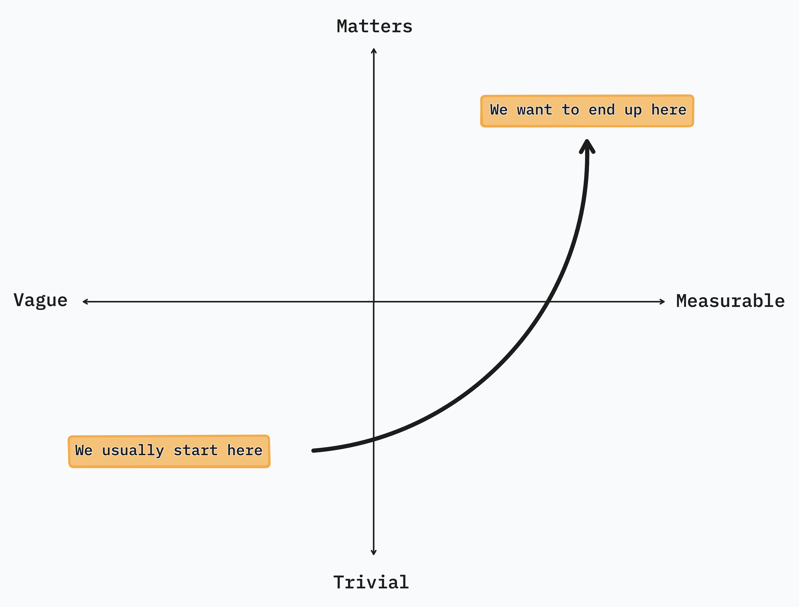

::: notes
When we're starting out, we tend to ask questions that are both vague and trivial. That's fine because it's the starting point. The goal is to move to questions that matter and are measurable. You can ask questions that matter but are vague, and that won't do anything for you. So the direction is: make it specific enough to count first, then ask the deeper layer of why.
:::

---

## {.textcenter}

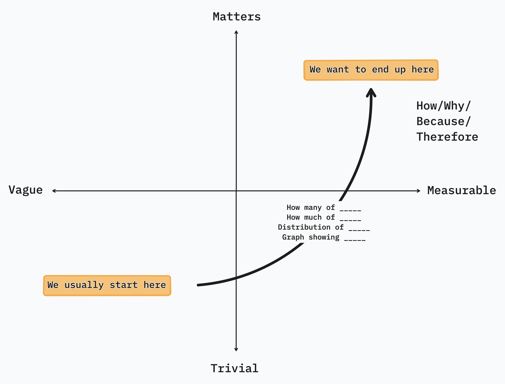

::: notes
Simple questions, how many, what's the distribution, what's the comparison, open the door to deeper questions. Why does it happen? What's the consequence? Because this happened, therefore this happened. You start with something trivial and countable, and it leads you somewhere interesting.
:::

##

::: r-fit-text
I am curious about [*[Topic]*]{.orange},

so I will measure [*[Data]*]{.red}

to see if [*[Hypothesis]*]{.grey} is true.
:::

::: footer
Adapted from [Andrew Duckworth](https://grillopress.github.io/2018/12/19/trying-a-new-format-for-hypotheses.html)
:::

::: notes
A simple test: if you can finish this sentence, you have a good question. "I am curious about X, so I will measure Y to see if Z is true." For mine: I'm curious about namesake candidates, so I will count the votes they receive to see if this actually affects an election result. If you can fill that in, you're ready to start.
:::


# {.title}

::: r-fit-text
[2. Analysis]{.flow}
:::

::: notes
Analysis used to scare me because I'm not trained in statistics. What I eventually learned is that most interesting findings come from four very simple operations.
:::


## As little as [four operations.]{.orange}

::: {.incremental}
1. **Count** - How many?
2. **Filter** - Which ones?
3. **Sort** - What's biggest or smallest?
4. **Group** - How do categories compare?
:::

::: notes
How many? Which ones? What's the biggest or smallest? How do categories compare? These four, in combination, will get you almost everything you need. Or at least what is bare minimum of interest to a reader.
:::

---

And these can be **composed**, meaning you can combine them:

1. First filter for something
2. Group it into categories
3. Count items within categories

::: notes
And you can chain them. Filter for a subset, group it into categories, count within those categories. That's a three-step analysis and it will produce genuinely interesting findings on almost any dataset.
:::

---

## Simple (but shocking) example

:::: {.columns}
::: {.column width="40%"}
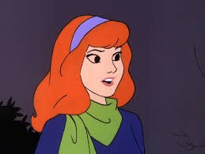{width="200px"}

[Someone catalogued 603 episodes of Scooby Doo](https://github.com/rfordatascience/tidytuesday/tree/main/data/2021/2021-07-13), let's count how many times Daphne catches a monster...
:::
::: {.column width="60%" .fragment .center}
<br/>
<br/>
```{r}
library(tidyverse)
library(knitr)
library(tidyverse)

tuesdata <- tidytuesdayR::tt_load('2021-07-13')

scoobydoo <- tuesdata$scoobydoo
scoobydoo %>%
  mutate(total_episodes = n()) %>%
  filter(caught_daphnie == "TRUE") %>%
  summarize(
    "caught_by_daphne" = n(),
    "total_episodes" = first(total_episodes)
  ) %>%
  kable()
```

:::
::::

::: notes
Simple example. Someone watched all 603 episodes of Scooby-Doo and catalogued variables, including who catches the monster in each episode. Daphne is famously the damsel in distress. So I just counted: how many episodes does she actually catch the monster?  In almost 95% of episodes, Daphne is not the one catching anything. That single count, by itself, tells a story about how the show is written. We could then compare with Velma, compare male and female characters overall. But it started with just counting.
:::

---

## Largest, Smallest, Most, Least...{background-color="#F4F4F4"}

<br/>
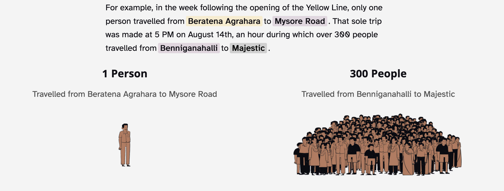

::: footer
[How Bangalore Uses The Metro](https://diagramchasing.fun/2025/how-bangalore-uses-the-metro)
:::

::: notes
Filtering for extremes is also very useful. In this story about Bangalore's metro, I was looking at average ridership on any given route. And I found that on one specific route, station A to station B to station D, there was only one person traveling that unique path every day. Versus 300 people on any average pair of stations. That's a finding. And it came from just sorting to find the bottom of a list.
:::

---

## {.textcenter}

::: r-fit-text
If nothing interesting appears,

that's a signal to [revisit the question]{.orange},

not to run fancier statistics.
:::

::: notes
When analysis returns nothing interesting, that usually means the question wasn't specific enough, or the proxy wasn't right. Go back to the question.
:::

# {.title}

::: r-fit-text
[3. Synthesis]{.flow}
:::

::: notes
You've asked a question, built a measurement, run your operations. Now you have a finding. Synthesis is two moves: declare what you found, and choose the form that reveals it.
:::

---

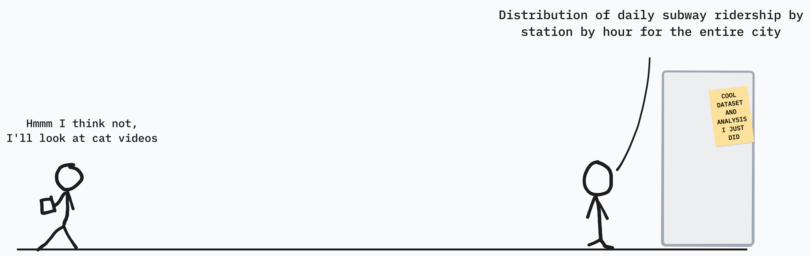

::: notes
Take the metro data. I could present it as: "distribution of daily subway ridership by station by hour for the entire city." That's accurate. That's what I found. It interests approximately no one outside of a transport planning meeting.
:::

---

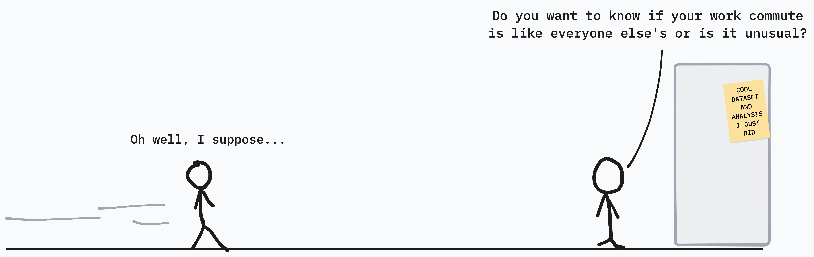

::: notes
Or I could ask: do you want to know if your work commute is like everyone else's? Are you that one person on a unique route, or are you one of 300? Now it's personal. Now the reader has a reason to care. The data is the same. The synthesis is different. That's the whole job.
:::


## {.pullquote}

> *"If a story is not about the hearer he will not listen... The strange and foreign is not interesting, only the deeply personal and familiar"*
>
> — John Steinbeck, *East of Eden*

::: notes
Steinbeck said, in the context of fiction, that if a story is not about the hearer, they will not listen. I think this applies completely to data. The reader is the point.
:::

---

## Readers probably want to know...

- **Normals** - Describe what "typical" looks like
- **Comparison** - How does one count compare to another?
- **Trends** - Are things going up, going down, staying the same?
- **Exceptions** - What's surprising? Some outliers?

::: notes
Your findings tend to take one of four shapes: normals, comparisons, trends, or exceptions. Knowing which one you have tells you a lot about the form it wants to take.
:::

---

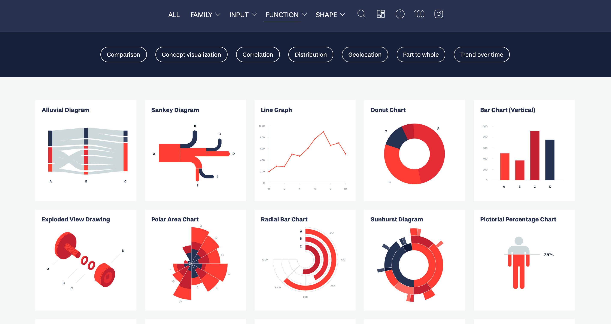

::: footer
[The Dataviz Project](https://datavizproject.com/#)
:::

::: notes
If you're stuck on what chart to use, the Dataviz Project is a useful reference it catalogs chart types by what kind of relationship they show. But the key point is that the form follows the finding. You pick the form last, not first.
:::
---

## Whatever you choose, remember to {.textcenter}

<br/>
<br/>

::: r-fit-text
Commit /
Headline /
Annotate /
Reframe
:::

::: notes
One thing I like to try and do is Connect the finding to something the reader already knows or feels.
:::

---

:::: {.columns}
::: {.column width="50%"}

We might not even restrict ourselves to charts.
<br/>
<br/>
In our election story, we found one election where a ballot had the most number of namesake candidates...
:::
::: {.column width="50%" .fragment}

| |
|---|
| CHANDU LAL SAHU |
| CHANDU LAL SAHU |
| CHANDU LAL SAHU |
| CHANDU LAL SAHU |
| CHANDU LAL SAHU |
| <span style="background-color: #90EE90; display: block;">CHANDU LAL SAHU</span> |
| CHANDOO LAL SAHU |
| CHANDU RAM SAHU |
| CHANDU LAL SAHU |
| CHANDURAM SAHU |
| CHANDU RAM SAHU |
| CHANDU LAL SAHU |

:::
::::

::: notes
And we don't even have to use a chart at all. In the election story, I found one election with the most extreme case of namesake candidates a ballot where one candidate was facing eleven other people with nearly the same name. Chandu Lal Sahu facing ten or eleven other Chandu Lal Sahus. When I found this in the data, I was genuinely amused. I told my illustrator friend about it and said I don't want to show this with a chart. And he came back with ideas.
:::

---

:::: {.columns}
::: {.column width="50%"}

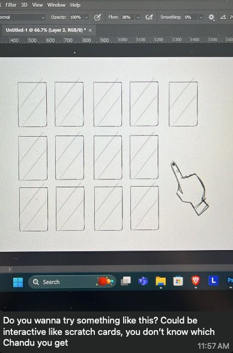{width="74%"}

:::
::: {.column width="50%"}
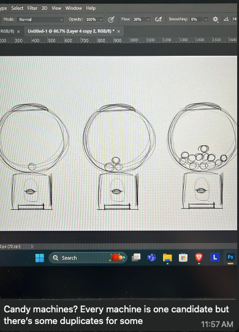{width="80%"}
:::
::::

::: notes
He asked: what if it was like a scratch card, where you shuffle and you don't know which Chandu you're going to get? Or like a candy machine where there are duplicates? I loved the scratch card idea because it captured exactly what it would feel like to not know who the real candidate is especially if you're an illiterate voter trying to recognize a name on a ballot.
:::

## {.textcenter background-color="#FFFEFF"}


::: notes
So we built this interaction where the cards shuffle and we ask you to keep track of who you think the real one is. It's not proving anything analytically. It's trying to let someone feel, for a moment, how confusing this could actually be.
:::

---

I had also calculated a number for how similar two names are.

<br/>

::: {.r-fit-text}

| Names | Similarity | [Face]{style="color: #F8FBF8;"} | [Face]{style="color: #F8FBF8;"} |
|:---|:---:|:---:|:---:|
| [Aman / Raman]{.fragment fragment-index=1} | [[0.9]{.orange}]{.fragment fragment-index=1} | [{height="1.5em" style="vertical-align: middle;"}]{.fragment fragment-index=1} | [{height="1.5em" style="vertical-align: middle;"}]{.fragment fragment-index=1} |
| [Aman / John]{.fragment fragment-index=2} | [[0.0]{.red}]{.fragment fragment-index=2} | [{height="1.5em" style="vertical-align: middle;"}]{.fragment fragment-index=2} | [{height="1.5em" style="vertical-align: middle;"}]{.fragment fragment-index=2} |

:::

::: notes
I had also calculated a similarity score for how alike two names are, as part of the analysis. I was trying to figure out how to turn that number into a visual. My partner who's an illustrator suggested: what if names that score high generate faces that look similar, and names that score low generate faces that look different? Aman and Raman, very similar names, very similar faces. Aman and John, very different.
:::


## {.textcenter background-color="#FFFEFF"}

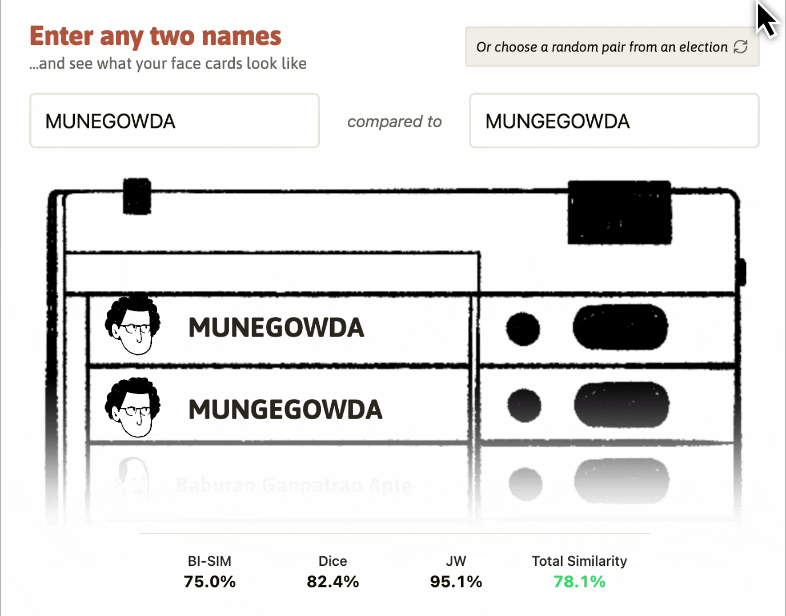

::: notes
So that's what we built. It's one form of encoding but it came from having a specific finding and asking what form would make it feel real to someone.
:::

## Don't restrict yourself! Use the right-side of your brain all you want

::: {.incremental}
- Animations
- Illustration and hand-drawn visuals
- Interactive experiences
- Scrollytelling
- Sound and audio
- Whatever form best serves the feeling
:::

. . .

The form is the last decision, and it is [entirely yours.]{.orange}

::: notes
Animation, illustration, interactive experiences, scrollytelling, sound these are all available to you. The form is the last decision, and it is entirely yours. What matters is that you've asked a good question, done the analysis, and synthesized what you found. After that, the visual is genuinely up to you.
:::

## {.textcenter}

::: r-fit-text
Pick the tool that removes the most

[friction between you and the question.]{.orange}
:::

::: notes
The tool is not the point. The question is the point. Pick whatever gets you to an answer fastest even if it's not the most powerful tool available. Upgrade when the question demands it, not before.
:::

---

## Excel with The Pudding {.textcenter}

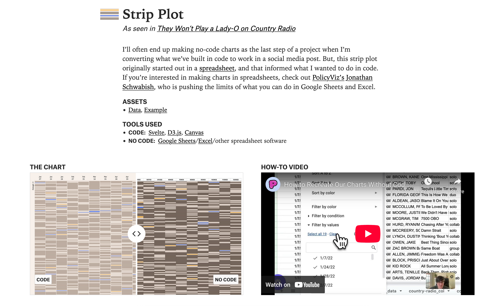

::: footer

[How to recreate our charts without code](https://pudding.cool/process/no-code-charts/)
:::

::: notes
The Pudding has a series of tutorials where they recreate their analyses entirely in Excel no code. These are excellent. They show you what those four operations look like on real data from projects you've probably already read.
:::

## Consume a lot. {background-color="#242933"}

:::: {.columns}
::: {.column width="40%" .center}

Some inspirational folks to follow.

Available as a [feed here](https://subs.aman.bh/i/?a=normal&get=c_6)

:::
::: {.column width="60%" .center}

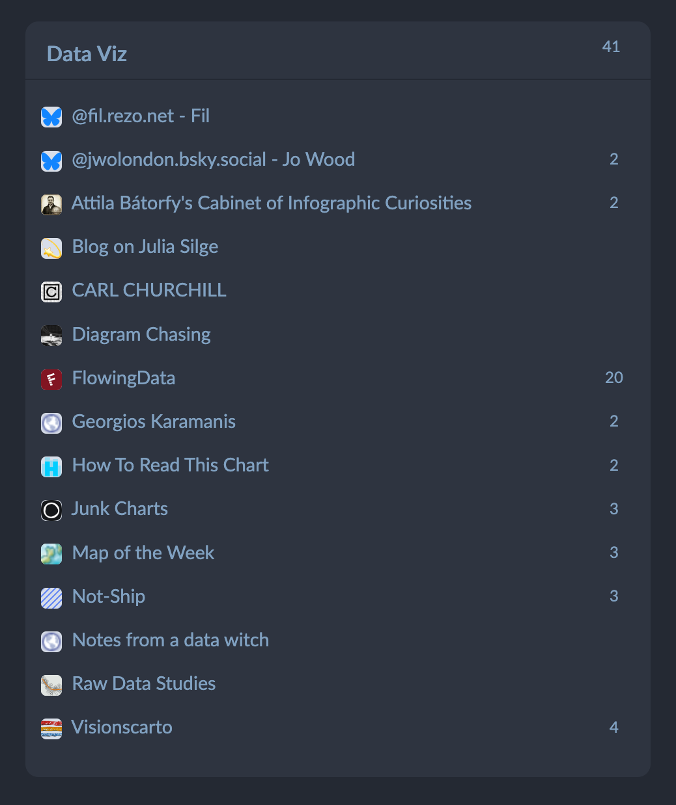{width="60%"}

:::
::::

::: notes
On a daily basis I read a lot, specifically so I can pick up what other people are doing and bring it into my own work. I'll send the slide deck after this it has a list of people to follow and a feed you can subscribe to.
:::

## Tinker constantly {background-color="#FFFFFF"}


[**Tidy Tuesday**](https://tidy.tuesday) is a weekly shared dataset, usable in any tool.  Small, consistent, personal work compounds.

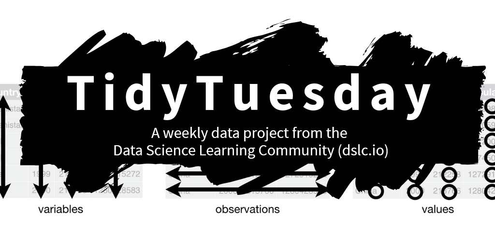

::: notes
And then Tidy Tuesday it's a weekly shared dataset, everyone is working on the same data, and you can see what everybody else made from it. Small, consistent work like this compounds. You don't have to make something great every week. You just have to make something. It's genuinely the most useful practice I know of.
:::

::: notes
I want to end with this. There is no specific kind of data person, and no specific kind of output that counts. As long as you ask a good question, do some analysis, and synthesize what you found how you show it is yours to decide. The form is the last decision.
:::

---

## {.textcenter}

Thank you!

<br/>
Website: [aman.bh](https://diagramchasing.fun) and [diagramchasing.fun](https://diagramchasing.fun)

::: notes
That's me. Thank you so much for listening.
:::