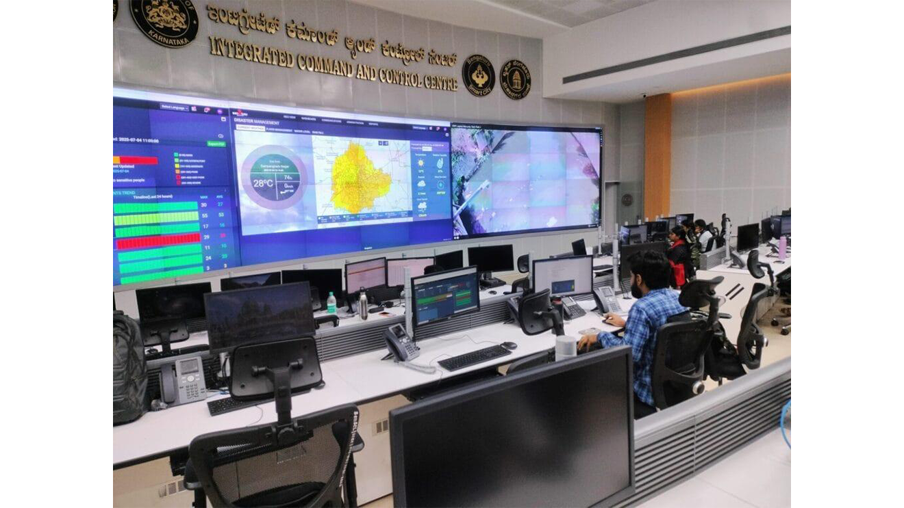
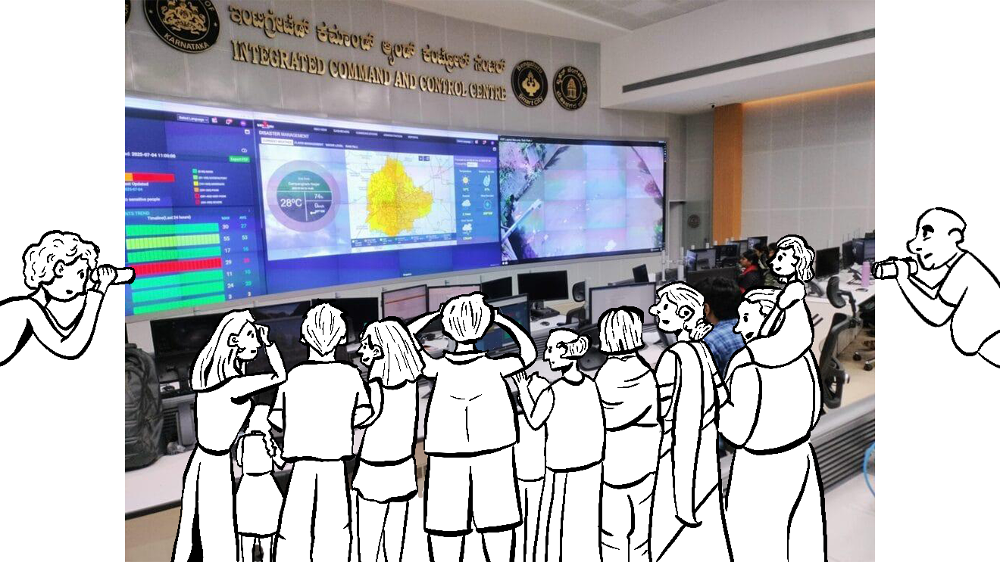
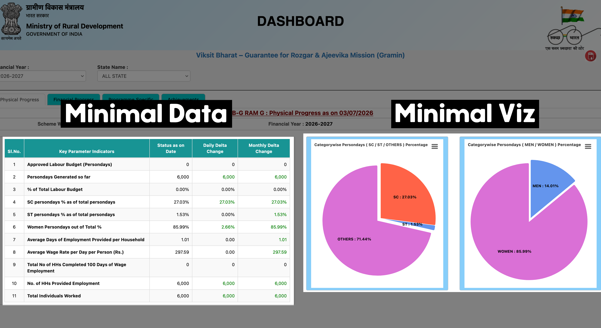
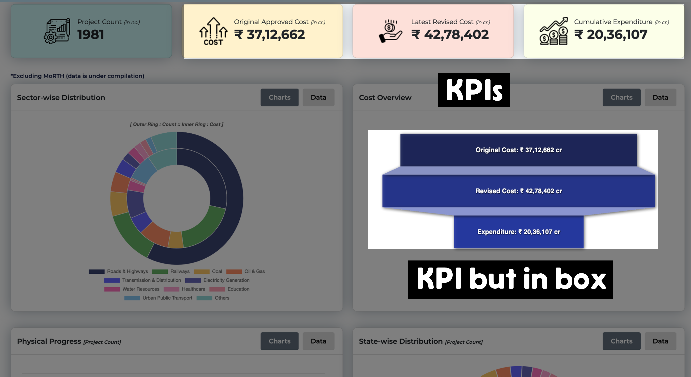
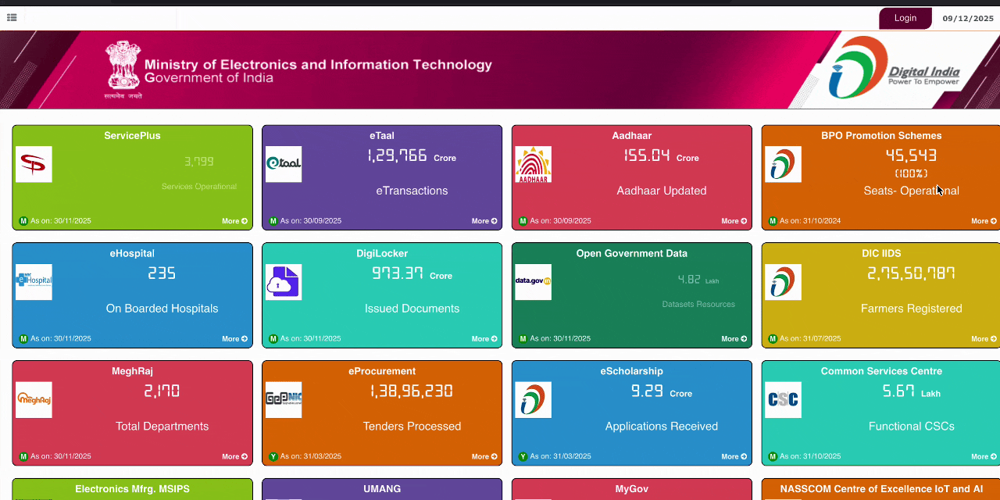

## {.center .textcenter}

::: r-fit-text
The dashboards of our discontents
:::

::: footer
Vizchitra, 2026
:::

## Project Gemini Mission Control Center, NASA

{.bleed}

##

{.bleed}

##

{.bleed}

##

{.shot fig-align="center"}

##

{.shot fig-align="center"}

##

{.shot width="110%" fig-align="center"}

## {.center .textcenter}

::: r-fit-text
This is not an aesthetics problem, but one of misunderstood needs
:::

## {background-image="attachments/odp/slide09-1.png" background-size="70%"}

## {.center .textcenter}

How did we get here?

::: {.r-fit-text .fragment}
Dashboards let you cut ribbons
:::

:::notes
Any problem can be solved by the creation of a new dashboard, which gives the appearance of activity without the danger of results.
:::

## {background-image="attachments/odp/ribbon.png" background-size="80%"}

##

:::: {.columns}
::: {.column .colmid width="28%"}
### Nobody's taking badass pictures of a dataset being released
:::
::: {.column width="72%"}
{.bleed}
:::
::::

## {background-image="attachments/odp/trend_launches.png" background-size="90%"}

## {.center .textcenter}

How did we get here?

::: r-fit-text
Dashboards are *the* familiar pattern.
:::

## {background-image="attachments/odp/dashboard.png" background-size="contain" background-color="#1A202C"}

[Line go up: I happy 😄]{.overlay-title .fragment style="background-color: #1A202C;"}

[Line go down: I sad 😔]{.overlay-title .fragment style="background-color: #1A202C"}

## {.center .textcenter}

::: {.bi-audience}
**BI Audience**

Known person, known question, and authority to act
:::

## {background-image="attachments/odp/who.png" background-size="80%"}

##

:::: {.columns}
::: {.column .bi-audience .colmid width="50%"}
[**BI Audience**]{.muted}

[Known person, known question, and authority to act]{.muted}
:::
::: {.column .bi-audience .colmid .right width="50%"}
**Public**

Strangers, no known questions, cannot take action
:::
::::

## {.center .textcenter}

::: r-fit-text
**Their only possible action is <mark>more work with the data</mark>**
:::

A story, a paper, a campaign, a tool

## {.center .textcenter}

::: r-fit-text
Dashboards answer the <mark>known unknowns</mark>, but close questions that can be asked    about <mark>unknown unknowns</mark>
:::

:::notes
When you publish only a dashboard for public data, you're imposing your worldview on everyone else. You're saying "these are the only questions worth asking" and "this is the only way to look at it." dashboards are for known unknowns, but raw logs/querying are for unknown unknowns.
:::

## {.center .textcenter}

::: r-fit-text
What can generous infrastructure look like?
:::

[Spoiler: There's a Magic Solution]{.rainbow}

## {.textcenter}

::: {.r-stack}
{.shot height="780"}

{.shot .fragment height="780"}
:::

## State censorship is recorded in certificates near the toilet in my nearest theater

{.shot width="110%" fig-align="center"}

## {.center .textcenter}

:::: {.ecert}
[CENTRAL BOARD OF FILM CERTIFICATION]{.ecert-head}

[**Film** : "UNTITLED MASS MOVIE" (Color) (2-D) · **Cert No.** DIL/7/86/2025-HYD · Rated **A**]{.ecert-kv}

[Endorsement]{.ecert-band}

| Cut No. | Description | Duration |
|:-------:|:------------|---------:|
| 1 | Excise the word <mark>"Old Monk"</mark> wherever it occurs (also in subtitle text) | 00.00 |
| 2 | <mark>Reduce the duration of kissing scene by exactly 50%</mark> | 00.16 |
| 3 | Delete the visuals and dialogue regarding <mark>flirting with nun</mark> character, in total | 00.35 |
| 4 | Mute the expletive at 1.42.06 and replace with <mark>sound of conch</mark> | 00.00 |
|   | **Total :** | **00.51** |
::::

## {background-image="attachments/odp/cbfc-chart.png" background-size="contain"}

## {background-image="attachments/odp/slide27-1.png" background-size="contain"}

{.sketch .absolute right="-1%" bottom="-1%" height="440"}

## {background-color="#0d1117" .center .textcenter}

::: {.filetree}
`censor-board-cuts/` 
`├── scripts/` 
`├── metadata/` 
`├── README.md` 
`└──` [`data.csv`]{.csv }
:::

[Every film, every cut, every certificate in one file!]{.kicker}

## {background-image="attachments/odp/slide29-1.png" background-size="contain"}

## {.textcenter background-color="#F1E6DC"}

[Horses? Maps? Shah Rukh Khan?]{.kicker}

{width="78%"}

## Every film, actor, theme is a link you can share {background-color="#F1E6DC" .center .textcenter}

::: {.permalinks}
`cbfc.watch/`[`film/sinners-2025`]{.plink}  
`cbfc.watch/`[`browse/actors/fahadh-faasil`]{.plink }  
`cbfc.watch/`[`browse/content/religious`]{.plink }  
`cbfc.watch/`[`search?q=maps&language=English`]{.plink }
:::

## {background-image="attachments/odp/slide32-1.png" background-size="contain"  background-color="#F1E6DC"}

## {background-color="#0d1117" .textcenter}

[Ask ChatGPT about a film's censor cuts…]{.kicker style="color: #ffffff;"}

{width="104%" .bleed}

[Linkable pages makes us *the* source.]{.callout-box .absolute bottom="4%" right="50%"}

## {.textcenter}

[We show our work.]{.kicker}

::: {.recipe}
[`data.csv`]{.chip-data} [+]{.op} [`analysis-notebook`]{.chip-nb} [=]{.op} [every chart on the site]{.result}
:::

{.shot width="92%"}

## {.textcenter}

{.shot width="56%"}

:::: {.columns}
::: {.column .textcenter width="50%"}
{.shot width="94%"}
:::
::: {.column .textcenter width="50%"}
{.shot width="94%"}
:::
::::

##

[And data flows back in!]{.kicker .textcenter style="display: block;"}

:::: {.columns}
::: {.column .colmid .textcenter width="58%"}
{.shot width="90%"}
:::
::: {.column .colmid width="42%"}
::: {.imsg}
[Btw the multiscan on the contribute page is great!!]{.bubble }
[Got a whole booklet 22:14]{.bubble }
[thx man, updated 🫡]{.bubble-out }
:::
:::
::::

## {.center .textcenter}

::: r-fit-text
There is more than one way to public some data.
:::

## {.center .textcenter}

::: r-fit-text
Who spends more time cleaning up after meals?
:::

## {.textcenter}

{width="72%"}

**Spread out across multiple files and documents**

## {background-image="attachments/odp/slide45-1.png ".textcenter}

[Every field is a numeric code]{.callout-box .absolute bottom="4%" right="50%"}

## {auto-animate="true" auto-animate-duration="0.8" auto-animate-easing="ease-in-out" .textcenter}

| [sector]{data-id="h1"} | [district]{data-id="h2"} | [gender]{data-id="h3"} | [religion]{data-id="h4"} | [activity]{data-id="h5"} |
|:------:|:--------:|:------:|:--------:|:--------:|
| [1]{data-id="c11" .code} | [13]{data-id="c12" .code} | [1]{data-id="c13" .code} | [1]{data-id="c14" .code} | [31]{data-id="c15" .code} |
| [1]{data-id="c21" .code} | [13]{data-id="c22" .code} | [2]{data-id="c23" .code} | [1]{data-id="c24" .code} | [92]{data-id="c25" .code} |
| [2]{data-id="c31" .code} | [13]{data-id="c32" .code} | [1]{data-id="c33" .code} | [2]{data-id="c34" .code} | [11]{data-id="c35" .code} |

**The codes mean nothing without a separate codebook**

<!-- ::: {.codebook .absolute top="6%"}
`codebook.pdf` sector 1 = Rural · 2 = Urban · gender 2 = female · religion 2 = Islam · activity 92 = domestic duties · …
::: -->

{.sketch .absolute right="-1%" bottom="-1%" height="440"}

## {.textcenter}

| [sector]{data-id="h1"} | [district]{data-id="h2"} | [gender]{data-id="h3"} | [religion]{data-id="h4"} | [activity]{data-id="h5"} |
|:------:|:--------:|:------:|:--------:|:--------:|
| [Rural]{data-id="c11" .label} | [Jammu]{data-id="c12" .label auto-animate-delay="0.1"} | [male]{data-id="c13" .label auto-animate-delay="0.2"} | [Hinduism]{data-id="c14" .label auto-animate-delay="0.3"} | [salaried work]{data-id="c15" .label auto-animate-delay="0.4"} |
| [Rural]{data-id="c21" .label} | [Jammu]{data-id="c22" .label auto-animate-delay="0.1"} | [female]{data-id="c23" .label auto-animate-delay="0.2"} | [Hinduism]{data-id="c24" .label auto-animate-delay="0.3"} | [domestic duties]{data-id="c25" .label auto-animate-delay="0.4"} |
| [Urban]{data-id="c31" .label} | [Jammu]{data-id="c32" .label auto-animate-delay="0.1"} | [male]{data-id="c33" .label auto-animate-delay="0.2"} | [Islam]{data-id="c34" .label auto-animate-delay="0.3"} | [self-employed]{data-id="c35" .label auto-animate-delay="0.4"} |

**Do the work: map it once, publish one usable file**

{.sketch .absolute right="-1" bottom="-1%" height="440"}

## {background-image="attachments/odp/slide49-1.png" .textcenter  background-size="contain"}
[Run complex queries right in your browser (no server!)]{.callout-box  .absolute bottom="4%" left="50%"}

## {.textcenter}

**Who spends more time cleaning up after meals?**

:::: {.columns}
::: {.column width="50%" .textcenter}
{width="84%"}
:::
::: {.column width="50%" .textcenter}
{width="84%"}
:::
::::

## {.textcenter}

**Share your analysis with anyone with a link**

::: {.permalinks style="font-size: 0.7em;"}
`diagramchasing.fun/time-use-explorer?`[`view=time_analysis`]{.plink}`&`[`time=9:00–10:00`]{.plink}`&`[`state=karnataka`]{.plink}
:::

{width="84%"}

## {background-image="attachments/odp/slide52-1.png" background-size="contain" background-color="#000000"}

## {background-image="attachments/odp/slide53-1.png" background-size="contain"}

## {.center .textcenter}

::: r-fit-text
What can you do for the public?
:::

## {.center .textcenter}

::: r-fit-text
Remember, the public's only action is <mark>more work with the data</mark>
:::

So build for the strangers who will do that work!

## The chart is an advertisement {.takeaway}

A wrapper, a lure, that draws attention the dataset doesn't have yet.

- "I don't care about CBFC, but I care about Superman."

## The link is a necessary vehicle {.takeaway}

It lets a finding travel without you.  We want things to go outwards.

## The _data_ is the main product {.takeaway}

Not the viz or the dash! Charts get forgotten and websites will rot,   but a CSV is what
the next person's work is built on.

## {.recap}

Charts are only advertisements
:   They will draw attention for the dataset.

Links are a vehicle to the world
:   They let things travel outwards.

The data is the product
:   Please, just publish the data. Seedhi baat, no bakwaas.

If you do nothing else this month, ship a CSV!

## {background-image="attachments/odp/slide61-2.png" background-size="cover" .textcenter}

[Let us build things that start something, not things where the reader stops]{.callout-box  .absolute bottom="4%" left="50%"  style="font-size: 0.95em;"}

## Thank you!   Grab some Diagram Chasing merch outside :)

:::: {.columns}
::: {.column .colmid width="60%"}

### Find me at

- 🔗 aman.bh
- 🔗 diagramchasing.fun
:::
::: {.column .colmid .textcenter width="40%"}
{width="380"}
:::
::::

[Illustrations by Rhea Pradeep (@rhepository)]{.absolute bottom="2%" left="0" style="font-size: 0.75em; opacity: 0.7;"}