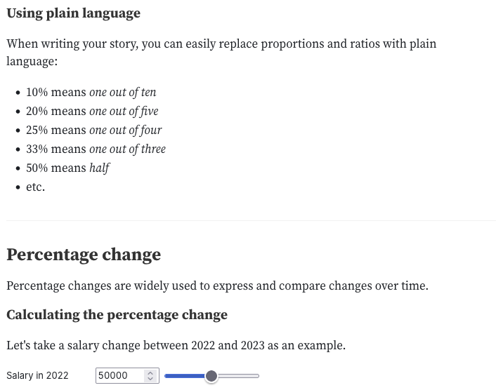

---
format:
  revealjs:
    theme: [default, style.scss]
    width: 1600
    height: 900
pagetitle: The Process of Data Storytelling — Purdue
---

# The Process of Data Storytelling

## Hello, I'm Aman! _uh-mun_

I am designer turned data visualization nerd.

My practice is focused on designing, developing and creating applications and stories from data.

---

// Insert Work Collage

---

In my free time, I my own data investigations, which is the stuff that _really_ excites me.

Finding my own line of inquiry and following it through to produce something visual that others can read and engage with.

---

## Votes in a Name

## Word Games

## Sherlock Holmes

---

While all of it is centered around data, about 80% of the work is some form of design-thinking so all in all, it is a very right-brained activity. Which is what I want to talk about today.

# Data Storytelling

## This is something of a buzzword

But there are two ways to think about it

---

1. Story - Grand narrative, sequence of events through time, leading to a revelation.
2. story - Intentional piece of communication that means something to a reader.

---

When you think of the second kind of `story`, a lot of possibilities open up.

---

// JBM Charts

// Spotify Wrapped

// Love letter to the subway

---

## Not every chart is a story

The data storytelling process involves two main things: explorations and explanations.

. . .

Sometimes we show the readers our explorations rather than making a point.

---

This is one of the very first charts I ever made, 5 years ago.

// Common Sense Media Chart

---

Here is another chart analyze how repetitive each song in Taylor Swift's albums are. Visually, this is a much better chart but...

---

## What do I want you to takeaway? I don't know!

Your natural reaction to this would be "Okay, and?"

---

For a `story`, you want to reduce your exploration to the point where it means something to someone else.

---

> “If a story is not about the hearer he [or she] will not listen . . . The strange and foreign is not interesting--only the deeply personal and familiar.”  ― John Steinbeck, East of Eden

---

## Constructing questions

The "aha" in a data story rarely comes from the math or a specific chart.

. . .

But rather, it comes from recognizing something relatable in that abstraction. Building this relation is more a creative skill than a statistical one.

---

// Insert the beginning of the votes story

notes: To begin this larger story, I start off by introducing the problem to you. I take a real example and show you what the ballot would have looked like to the people voting that day and why this can be confusing. Some of us may scoff at such a mistake, but what I show you next is proof that this is a real problem and it happens to people around us. Even if _you_ don't find yourself having the same problem, the reality of the experience is undeniable.

---

## Seek to go one layer deeper

// Insert Matrix Graphics

---

## Sometimes the data exists.

If so, great! Onwards.

. . .

More often, you have to decide what to measure, so you try to create a _proxy_! What is a number that best approximates your concept?

---

For my concept of electoral 'confusion', the measure can be a number for how similar those names are.

Aman / Damon = 0.7
Aman / John = 0

---

## Four Operations

Numbers, a question, time for some math. Fortunately, arriving at interesting insights about your data can take as little as four key operations.

---

1. count (how many?)
2. filter (which ones?)
3. sort (what's biggest/smallest?)
4. group (how do categories compare?)

---

// Show examples from Metro Story

// Show examples of Milton

---

If nothing interesting appears, that's a signal to revisit the question, not to run fancier statistics.

---

Math for Journalists is a great resource for adding basic things to your toolkit that will make you even more confident.

## Synthesizing the Finding

You've asked a question, measured something, and run your counts and comparisons. Now you have findings.

. . .

Synthesis is two moves: declare what you found and choose the form that reveals it.

---

 once you've run your operations, your findings tend to take one of four shapes

---

### Normal Patterns

What is the 'average', the usual?

### Comparison

How does one count compare to the other?

### Trends

Are things going up, down, staying the same?

### Exceptions

Interesting findings

---

Form follows function, choose the chart you need!

---

## Or...don't choose a chart at all?

We can do this through animations, illustrations, games, interactive websites. Whatever you want!

// Show the face interactive from Votes in a Name

# Going beyond your course

How do you do this, how do you get better at it?

. . .

Firstly, pick the tool that removes the most friction between you and the question.

## Data Analysis with Excel

// Show Pudding Tutorial

## Orange Data Mining

// Show blogpost snippets

## R!

Show drob's screencasts

## Consume a lot, practice a lot

Blog suggestions
Tidytuesday
Tinker on the regular!

# You don't have to become 'data' people

> I consider myself to be a “professional question asker”. Amber Thomas

Bring your existing sensibilities — for story, for form, for empathy, for play — into a domain that wants and needs them! Have fun.

