## {.center .textcenter}

::: r-fit-text
The dashboards of our discontents
:::

::: footer
Vizchitra, 2026
:::

##

:::: {.columns}
::: {.column .colmid width="38%"}
**Project Gemini Mission Control Center, NASA**
  
**Somewhat unattainable.**
:::
::: {.column width="62%"}
{.bleed}
:::
::::

##

:::: {.columns}
::: {.column .colmid width="38%"}
**Dholera City Control Room.**
  
**Somewhat attainable.**
:::
::: {.column width="62%"}
{.bleed}
:::
::::

## {background-image="attachments/odp/slide04-1.png" background-size="80%"}

## {background-image="attachments/odp/looking-in.png" background-size="80%"}

## {background-image="attachments/odp/slide07-1.png" background-size="contain"}

[We get KPIs!]{.callout-box .absolute top="33%" left="30%"}

## {.center .textcenter}

::: r-fit-text
This is not an aesthetics problem, but one of misunderstood needs
:::

## {background-image="attachments/odp/slide09-1.png" background-size="70%"}

## {.center .textcenter}

How did we get here?

::: {.r-fit-text .fragment}
Dashboards let you cut ribbons
:::

:::notes
Any problem can be solved by the creation of a new dashboard, which gives the appearance of activity without the danger of results.
:::

## {background-image="attachments/odp/ribbon.png" background-size="80%"}

##

:::: {.columns}
::: {.column .colmid width="28%"}
**Nobody's taking pictures of a dataset being released**
:::
::: {.column width="72%"}
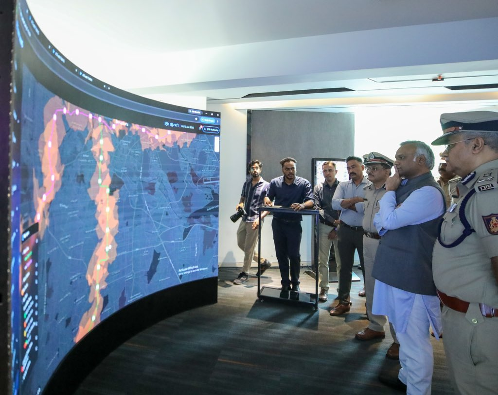{.bleed}
:::
::::

## {background-image="attachments/odp/trend_launches.png" background-size="90%"}

## {.center .textcenter}

How did we get here?

::: r-fit-text
Dashboards are *the* familiar pattern.
:::

## {background-image="attachments/odp/dashboard.png" background-size="contain" background-color="#1A202C"}

[Line go up: I happy 😄]{.overlay-title .fragment style="background-color: #1A202C"}

[Line go down: I sad 😔]{.overlay-title .fragment style="background-color: #1A202C"}

## {.center .textcenter}

::: {.bi-audience}
**BI Audience**

Known person, known question, and authority to act
:::

## {background-image="attachments/odp/who.png" background-size="80%"}

##

:::: {.columns}
::: {.column .bi-audience .colmid width="50%"}
[**BI Audience**]{.muted}

[Known person, known question, and authority to act]{.muted}
:::
::: {.column .bi-audience .colmid .right width="50%"}
**Public**

Strangers, no known questions, cannot take action
:::
::::

## {.center .textcenter}

::: r-fit-text
**Their only possible action is more work with the data**
:::

A story, a paper, a campaign, a tool

## {.center .textcenter}

::: r-fit-text
Dashboards answer the <mark>known unknowns</mark>, but close questions that can be asked    about <mark>unknown unknowns</mark>
:::

:::notes
When you publish only a dashboard for public data, you're imposing your worldview on everyone else. You're saying "these are the only questions worth asking" and "this is the only way to look at it." dashboards are for known unknowns, but raw logs/querying are for unknown unknowns.
:::

## {.center .textcenter}

::: r-fit-text
What can generous infrastructure look like?
:::

[Spoiler: There's a Magic Solution]{.rainbow}

## {.textcenter}

::: {.r-stack}
{.shot height="780"}

{.shot .fragment height="780"}
:::

##

:::: {.columns}
::: {.column width="50%"}
{.bleed}
:::
::: {.column .colmid width="50%"}
**State censorship is recorded in certificates near the toilet in my nearest theater**
:::
::::

## {.center .textcenter}

:::: {.ecert}
[CENTRAL BOARD OF FILM CERTIFICATION]{.ecert-head}

[**Film** : "UNTITLED MASS MOVIE" (Color) (2-D) · **Cert No.** DIL/7/86/2025-HYD · Rated **A**]{.ecert-kv}

[Endorsement]{.ecert-band}

| Cut No. | Description | Duration |
|:-------:|:------------|---------:|
| 1 | Excise the word <mark>"Old Monk"</mark> wherever it occurs (also in subtitle text) | 00.00 |
| 2 | <mark>Reduce the duration of kissing scene by exactly 50%</mark> | 00.16 |
| 3 | Delete the visuals and dialogue regarding <mark>flirting with nun</mark> character, in total | 00.35 |
| 4 | Mute the expletive at 1.42.06 and replace with <mark>sound of conch</mark> | 00.00 |
|   | **Total :** | **00.51** |
::::

## {background-image="attachments/odp/slide26-1.png" background-size="contain"}

##

:::: {.columns}
::: {.column .colmid width="40%"}
**The Government had other plans in store**
:::
::: {.column width="60%"}
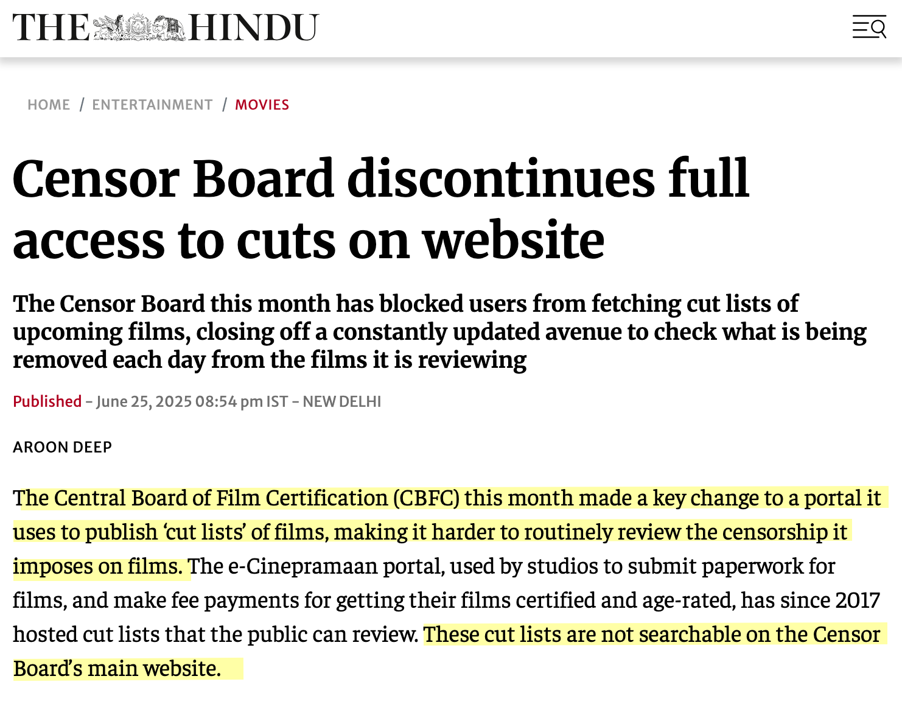{.bleed .contain}
:::
::::

## {background-color="#0d1117" .center .textcenter}

::: {.filetree}
`censor-board-cuts/` 
`├── scripts/` 
`├── metadata/` 
`├── README.md` 
`└──` [`data.csv`]{.csv .fragment fragment-index=1}
:::

[Every film, every cut, every certificate — in one file]{.kicker .fragment fragment-index=1}

## {background-image="attachments/odp/slide29-1.png" background-size="contain"}

## {.textcenter}

[Horses? Maps? Shah Rukh Khan?]{.kicker}

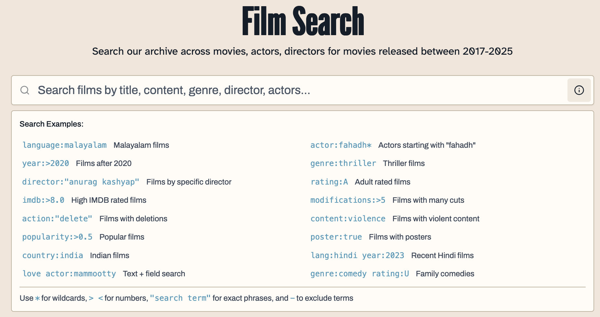{width="78%"}

##

::::: {.columns}
:::: {.column .colmid width="46%"}
[Permalinks!]{.kicker}

Why would you *not* want your users to share things? Everything is linkable!

::: {.urls}
- https://cbfc.watch/film/sinners-2025
- https://cbfc.watch/browse/actors/fahadh-faasil
- https://cbfc.watch/browse/content/religious
- https://cbfc.watch/search?q=maps+language=English
:::
::::
:::: {.column .colmid .textcenter width="54%"}
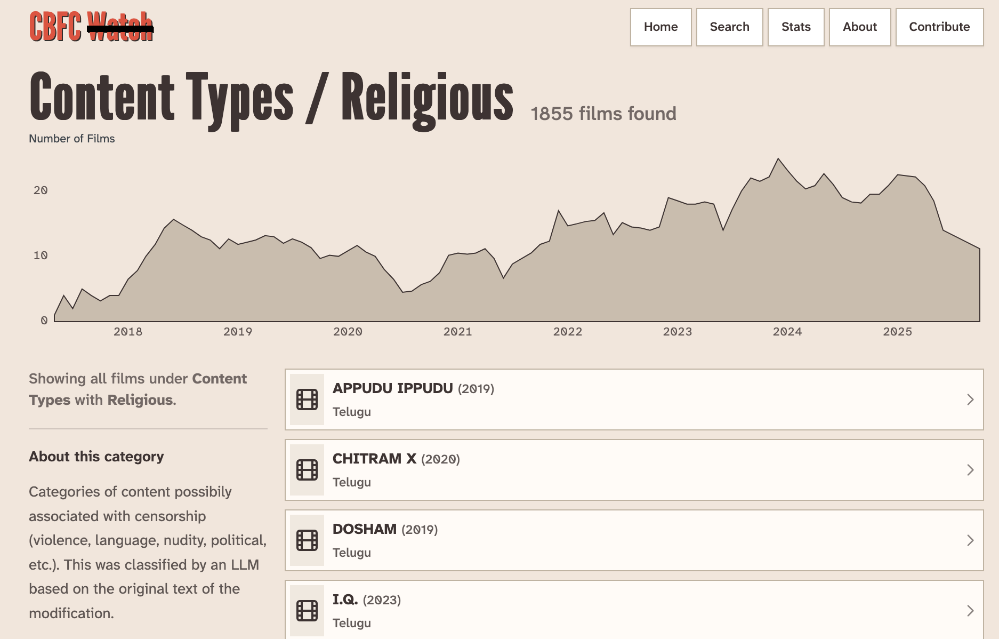{.shot width="92%"}
::::
:::::

## {background-image="attachments/odp/slide32-1.png" background-size="contain"}

## {background-color="#0d1117" .textcenter}

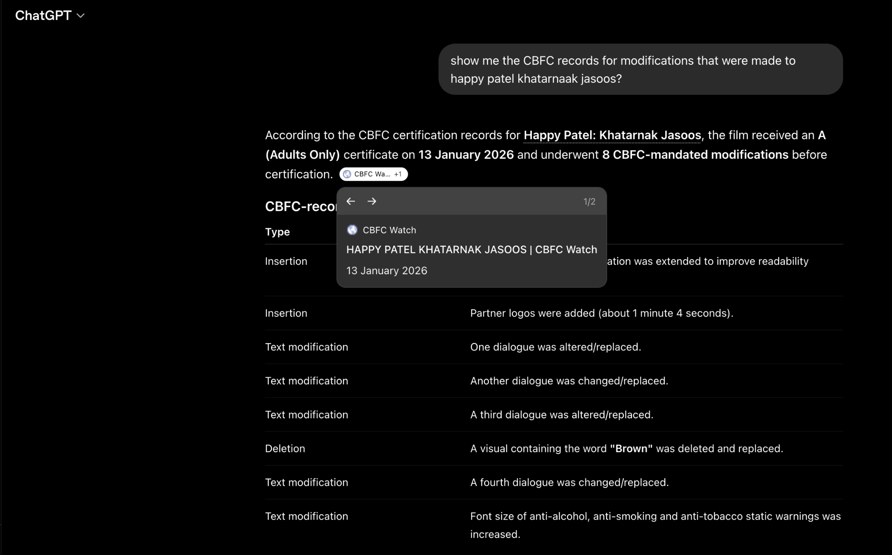{width="60%"}

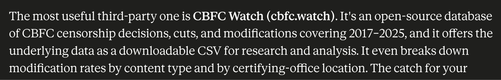{width="85%"}

##

:::: {.columns}
::: {.column .colmid width="34%"}
[Confused about the data? I'll show you!]{.kicker}
:::
::: {.column width="66%"}
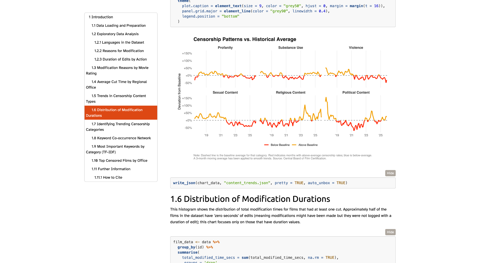{.bleed .contain}
:::
::::

## {.textcenter}

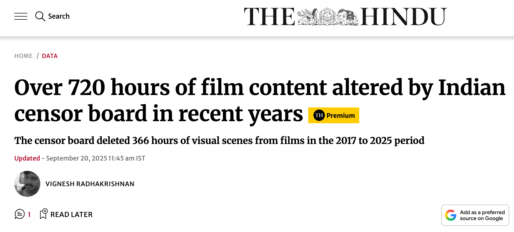{.shot width="56%"}

:::: {.columns}
::: {.column .textcenter width="50%"}
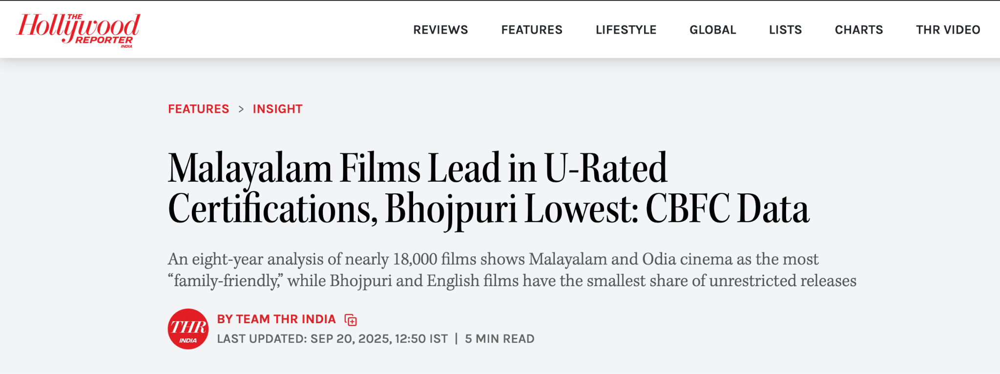{.shot .fragment width="94%"}
:::
::: {.column .textcenter width="50%"}
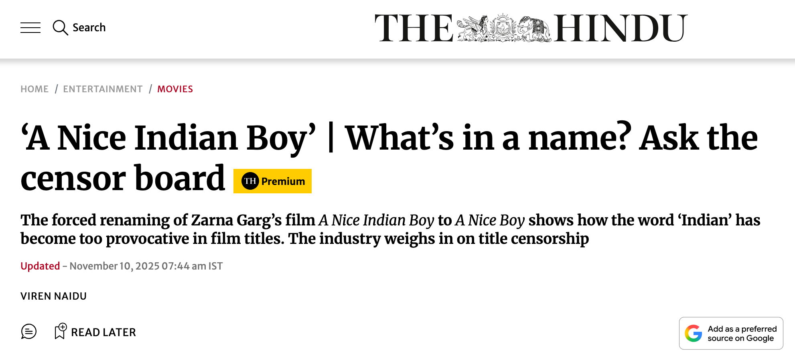{.shot .fragment width="94%"}
:::
::::

##

:::: {.columns}
::: {.column .colmid .textcenter width="58%"}
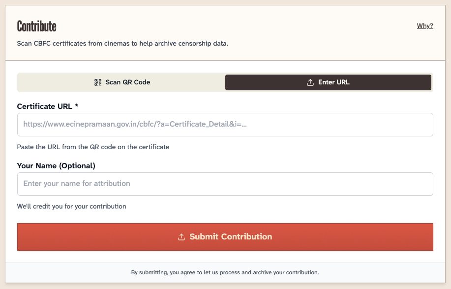{.shot width="90%"}
:::
::: {.column .colmid .textcenter width="42%"}
{.fragment width="90%"}
:::
::::

## {.center .textcenter}

::: r-fit-text
There is more than one way to public some data.
:::

## {.center .textcenter}

::: r-fit-text
Who spends more time cleaning up after meals?
:::

## {.textcenter}

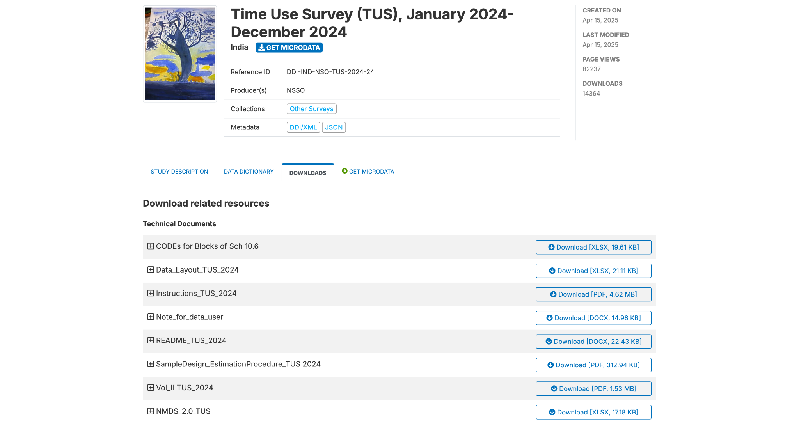{width="72%"}

**Spread out across multiple files and documents**

## {.textcenter}

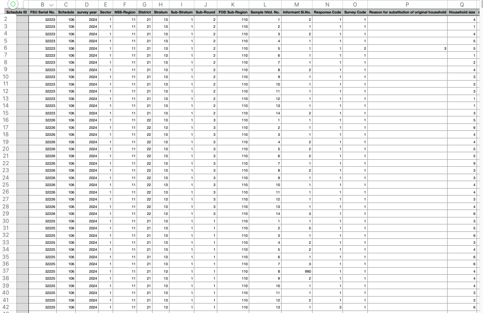{width="78%"}

**Every field is a numeric code**

## {auto-animate="true" auto-animate-duration="0.8" auto-animate-easing="ease-in-out" .textcenter}

| sector | district | gender | religion | activity |
|:------:|:--------:|:------:|:--------:|:--------:|
| [1]{data-id="c11" .code} | [13]{data-id="c12" .code} | [1]{data-id="c13" .code} | [1]{data-id="c14" .code} | [31]{data-id="c15" .code} |
| [1]{data-id="c21" .code} | [13]{data-id="c22" .code} | [2]{data-id="c23" .code} | [1]{data-id="c24" .code} | [92]{data-id="c25" .code} |
| [2]{data-id="c31" .code} | [13]{data-id="c32" .code} | [1]{data-id="c33" .code} | [2]{data-id="c34" .code} | [11]{data-id="c35" .code} |

::: {.codebook data-id="codebook"}
`sector` 1 = Rural · 2 = Urban 
`district` 13 = Jammu 
`gender` 1 = male · 2 = female 
`activity` 11 = self-employed · 31 = salaried work · 92 = domestic duties
....
:::

**The codes mean nothing without a separate codebook**

## {auto-animate="true" auto-animate-duration="0.8" auto-animate-easing="ease-in-out" .textcenter}

| sector | district | gender | religion | activity |
|:------:|:--------:|:------:|:--------:|:--------:|
| [Rural]{data-id="c11" .label} | [Jammu]{data-id="c12" .label auto-animate-delay="0.1"} | [male]{data-id="c13" .label auto-animate-delay="0.2"} | [Hinduism]{data-id="c14" .label auto-animate-delay="0.3"} | [salaried work]{data-id="c15" .label auto-animate-delay="0.4"} |
| [Rural]{data-id="c21" .label} | [Jammu]{data-id="c22" .label auto-animate-delay="0.1"} | [female]{data-id="c23" .label auto-animate-delay="0.2"} | [Hinduism]{data-id="c24" .label auto-animate-delay="0.3"} | [domestic duties]{data-id="c25" .label auto-animate-delay="0.4"} |
| [Urban]{data-id="c31" .label} | [Jammu]{data-id="c32" .label auto-animate-delay="0.1"} | [male]{data-id="c33" .label auto-animate-delay="0.2"} | [Islam]{data-id="c34" .label auto-animate-delay="0.3"} | [self-employed]{data-id="c35" .label auto-animate-delay="0.4"} |

**Do the work: map it once, publish one usable file**

## {.textcenter}

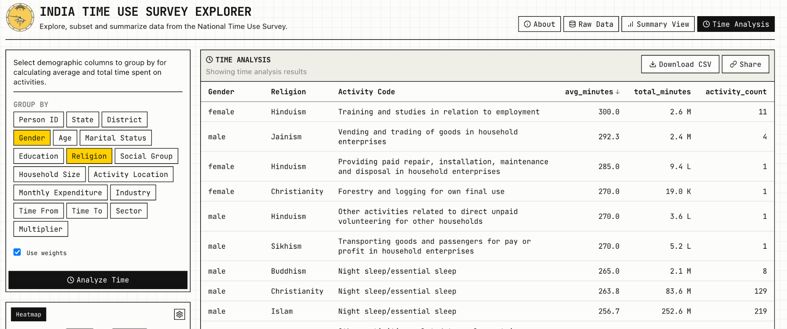{width="100%"}

**Run complex queries right in your browser (no server!)**

## {.textcenter}

**Who spends more time cleaning up after meals?**

:::: {.columns}
::: {.column width="50%" .textcenter}
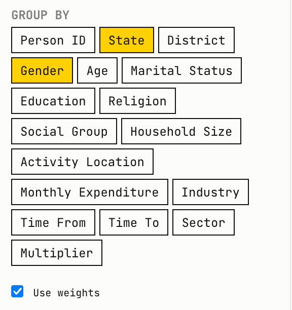{width="84%"}
:::
::: {.column width="50%" .textcenter}
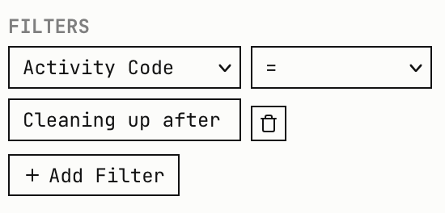{width="84%"}
:::
::::

## {.textcenter}

**Share your analysis with anyone with a link**

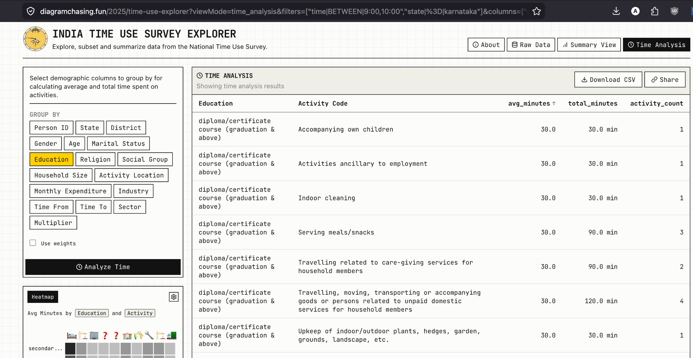{width="84%"}

## {background-image="attachments/odp/slide52-1.png" background-size="contain" background-color="#000000"}

## {background-image="attachments/odp/slide53-1.png" background-size="contain"}

## {.center .textcenter}

::: r-fit-text
What can you do for the public?
:::

<!-- ## A BI dashboard gets users, trust, and distribution by default {.takeaway}

A public data interface gets none — you have to design for them. -->

## Build so things can travel outward {.takeaway}

Maximize the surface area for shareability.

## Design trajectories, not users {.takeaway}

You can't design for a user you don't know.

- "I don't care about CBFC, but I care about Superman."
- "Wait, what else is censored??"
- "Give me all of it, I'll check myself."
- "Keep me updated."

## Charts are only an advertisement {.takeaway}

Present your view, but know that people also want to do more work.

## Assume you will lose interest {.takeaway}

A public data interface outlives the individual interest of the person building it.

## {.center .textcenter .r-fit-text}

[The Magic Solution, as promised]{.rainbow}

## A file anyone can download {.takeaway}

_Seedhi baat, no bakwas._

- If you design, you can chart around it.
- If you develop, you can make it queryable.
- If you work in government, you can simply release it.
- No one can viz on data that isn't there.

##  {.recap}

Build so things can travel outward
:   Maximize the surface area for shareability.

Design trajectories, not users
:   You can't design for a user you don't know.

Charts are only an advertisement
:   People will always want to do more work with the data.

Assume you will lose interest
:   Build things that outlive your attention.

Just publish the data
:   Please.

## {background-image="attachments/odp/slide61-2.png" background-size="cover" .textcenter}

[Let us build things that start something, not things where the reader stops]{.callout-box}
