## {.title .center}

::: r-fit-text
The dashboards of

[our discontents]{.flow}
:::

::: footer
[Against the terminal public-data dashboard · Vizchitra, 2026]{style="opacity:0.6;"}
:::

<!-- slide 2 -->
## Project Gemini Mission Control Center, NASA

Somewhat unattainable.

{width="70%"}

<!-- slide 3 -->
## Dholera City Control Room.

Somewhat attainable.

{width="70%"}

<!-- slide 4 -->
## {background-image="attachments/odp/slide04-1.jpg" background-size="contain"}

<!-- slide 5 -->
## We get donuts!

:::{.textcenter}
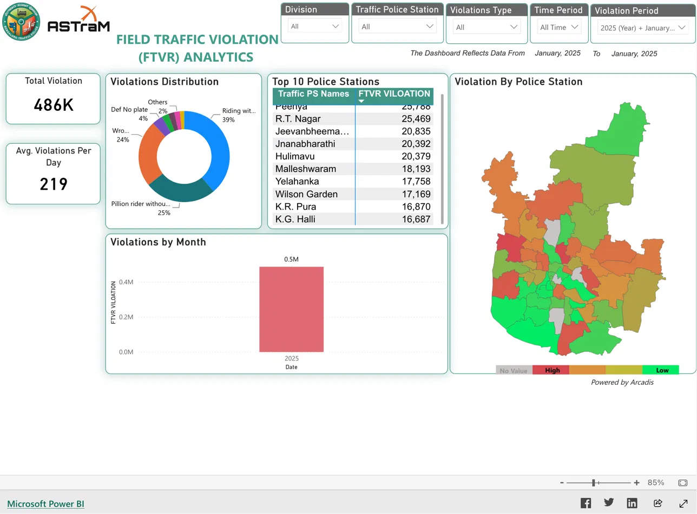{width="56%"}
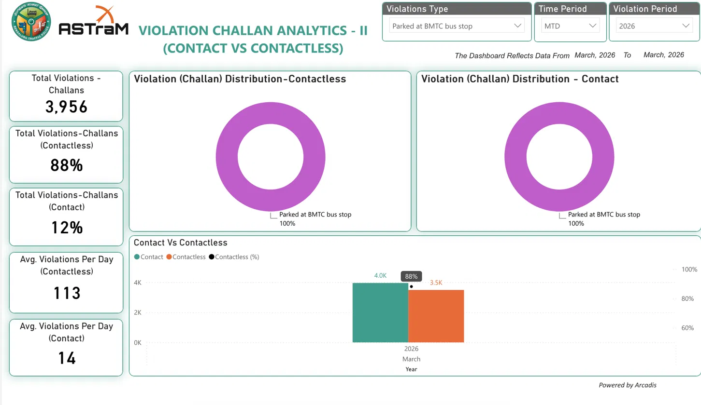{width="60%"}
:::

<!-- slide 6 -->
## We get small

Big Ass Numbers!

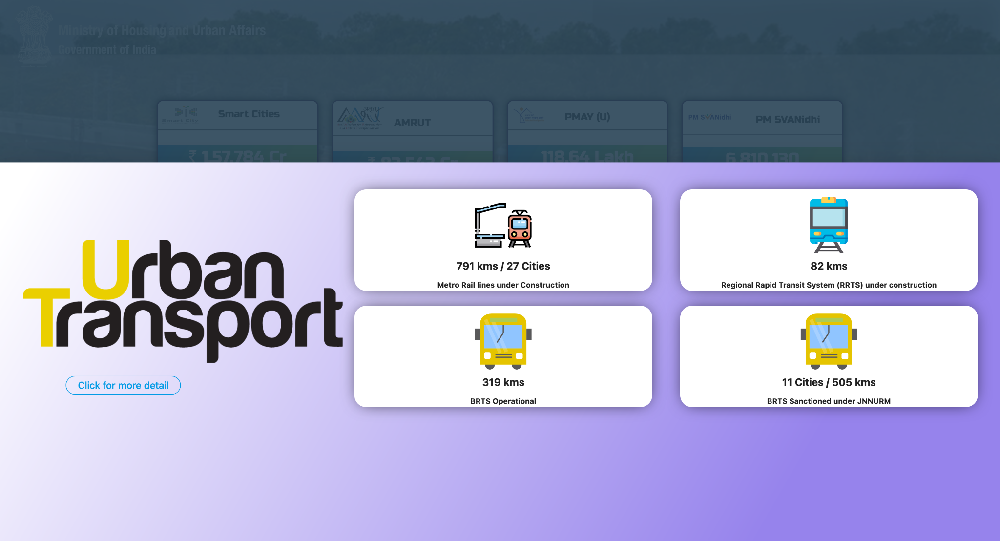{width="90%"}

<!-- slide 7 -->
## We get KPIs!

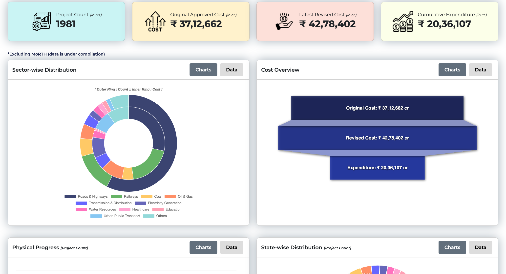{width="90%"}

<!-- slide 8 -->
## {.textcenter}

::: r-fit-text
This is not an aesthetics problem, but one of misunderstood needs
:::

<!-- slide 9 -->
## {background-image="attachments/odp/slide09-1.png" background-size="contain"}

<!-- slide 10 -->
## {.textcenter}

::: r-fit-text
How did we get here?

Dashboards

let you cut ribbons
:::

<!-- slide 11 -->
## {.textcenter}

:::{.textcenter}
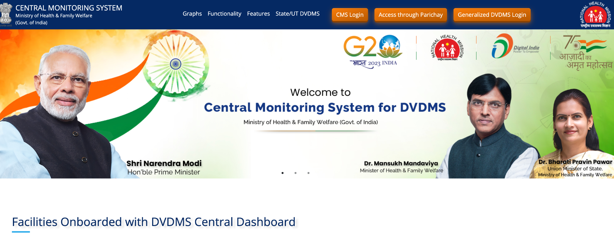{width="92%"}

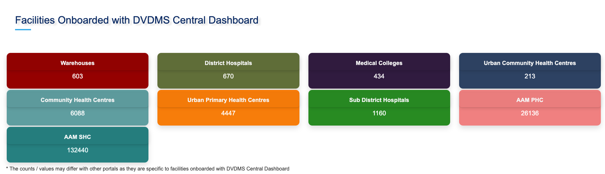{width="92%"}

:::

<!-- slide 12 -->
## How did we get here?

Dashboards are ribbon-cuttable.

Nobody’s taking pictures of a dataset release

{width="75%"}

<!-- slide 13 -->
## One every 7 days!

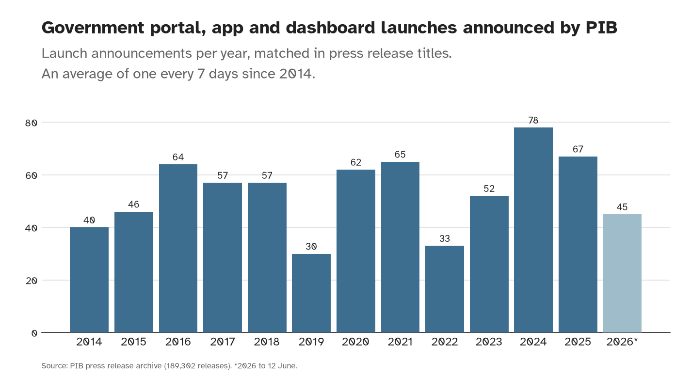{width="75%"}

<!-- slide 14 -->
## {.textcenter}

::: r-fit-text
How did we get here?

Dashboards are

the standard.
:::

<!-- slide 15 -->
## This is a “BI” dashboard

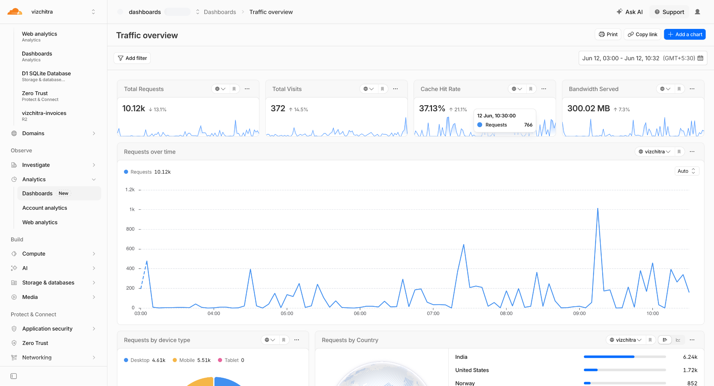{width="90%"}

<!-- slide 16 -->
## {.textcenter}

::: r-fit-text
BI Audience

Known person,

known question,

and authority to act
:::

<!-- slide 17 -->
## {.textcenter}

::: r-fit-text
Who is the public?

A journalist?

A scholar?

A curious teenager?

A vibe-coder?
:::

<!-- slide 18 -->
## {.textcenter}

::: r-fit-text
BI Audience

Known person,

known question,

and authority to act

Public

Strangers,

no known questions,

cannot take action
:::

<!-- slide 19 -->
## {.textcenter}

::: r-fit-text
Their only possible action is more work with the data

Their action is a story, a paper, a campaign, a tool
:::

<!-- slide 20 -->
## {.textcenter}

::: r-fit-text
As long as the dashboard is the entry point, it will preemptively close what questions can be asked
:::

<!-- slide 21 -->
## {.textcenter}

::: r-fit-text
What can generous infrastructure look like?
:::

<!-- slide 22 -->
## {background-image="attachments/odp/slide22-1.png" background-size="contain"}

<!-- slide 23 -->
## {.textcenter}

:::{.textcenter}
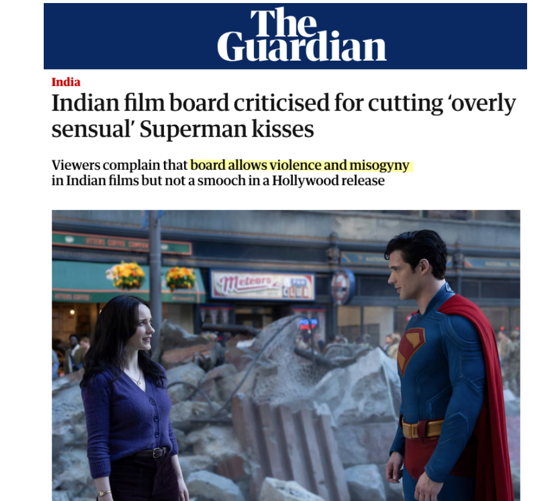{width="50%"}

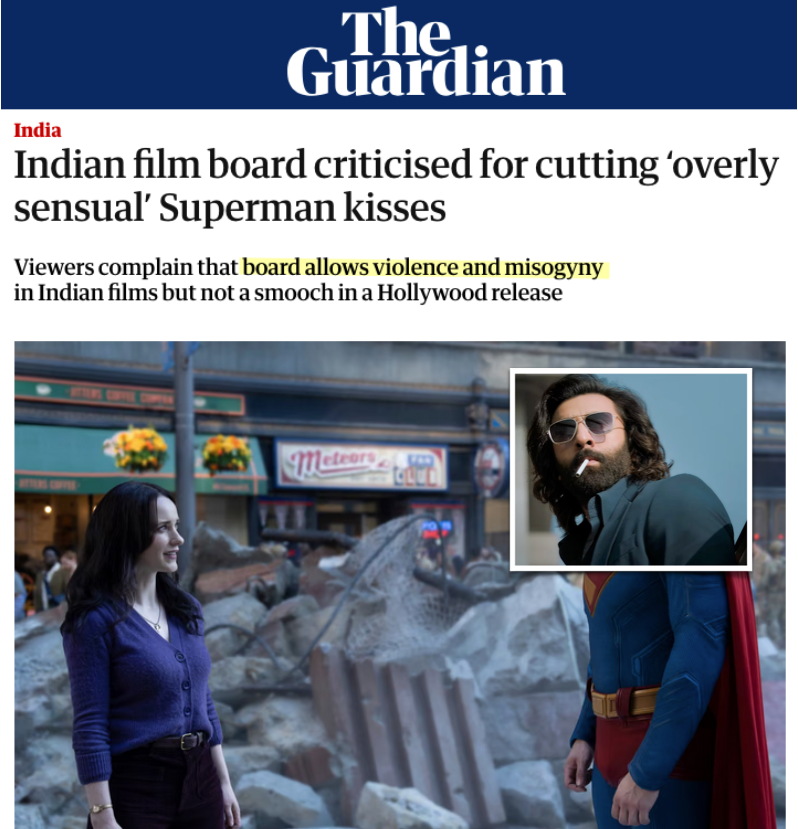{width="51%"}

:::

<!-- slide 24 -->
## State censorship is recorded in certificates near the toilet in my nearest theater

{width="42%"}

<!-- slide 25 -->
## {background-image="attachments/odp/slide25-1.png" background-size="contain"}

<!-- slide 26 -->
## {background-image="attachments/odp/slide26-1.png" background-size="contain"}

<!-- slide 27 -->
## The Government had other plans in store

{width="51%"}

<!-- slide 28 -->
## {background-image="attachments/odp/slide28-1.png" background-size="contain"}

<!-- slide 29 -->
## {background-image="attachments/odp/slide29-1.png" background-size="contain"}

<!-- slide 30 -->
## Horses? Maps? Shah Rukh Khan?

{width="79%"}

<!-- slide 31 -->
## Why would you not want your users to share things? Everything is linkable!

https://cbfc.watch/film/sinners-2025

https://cbfc.watch/browse/actors/fahadh-faasil

https://cbfc.watch/browse/content/religious

https://cbfc.watch/search?q=maps+language=English

Permalinks!

{width="66%"}

<!-- slide 32 -->
## {background-image="attachments/odp/slide32-1.png" background-size="contain"}

<!-- slide 33 -->
## {.textcenter}

:::{.textcenter}
{width="67%"}

{width="92%"}

:::

<!-- slide 34 -->
## Archived for posterity. It’s not about just US, of course

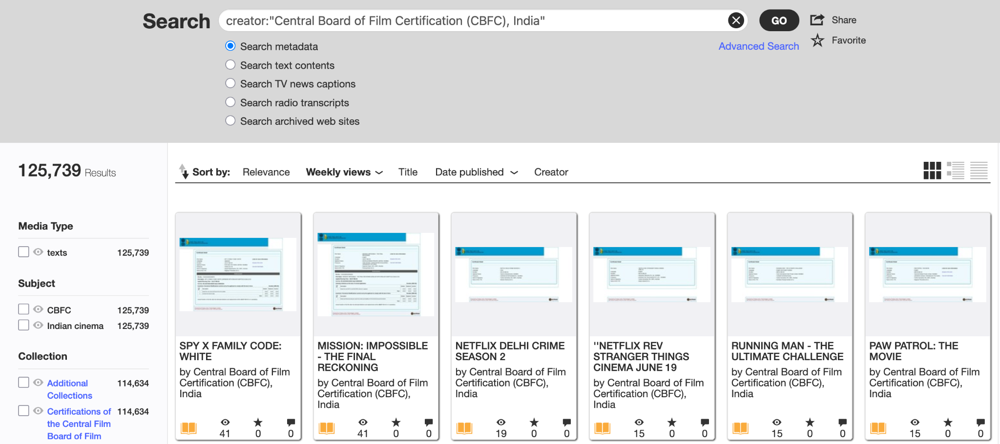{width="92%"}

<!-- slide 35 -->
## Confused about the data? I’ll show you!

{width="90%"}

<!-- slide 36 -->
## {.textcenter}

:::{.textcenter}
{width="61%"}

{width="68%"}

{width="68%"}

:::

<!-- slide 37 -->
## {background-image="attachments/odp/slide37-1.png" background-size="contain"}

<!-- slide 38 -->
## {background-image="attachments/odp/slide38-1.png" background-size="contain"}

<!-- slide 39 -->
## Charts can be vehicles of exciting, deeper data literacy.

As long as they don’t stop there.

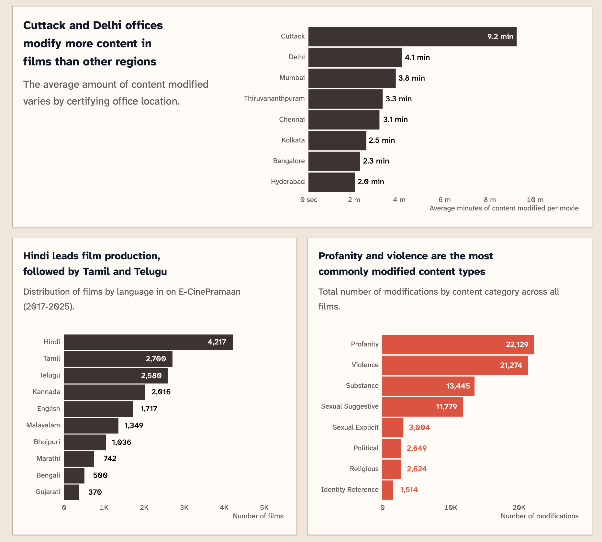{width="59%"}

<!-- slide 40 -->
## {.textcenter}

:::{.textcenter}
{width="80%"}

{width="73%"}

:::

<!-- slide 41 -->
## Essentially free to run, and still has better uptime than most government websites.

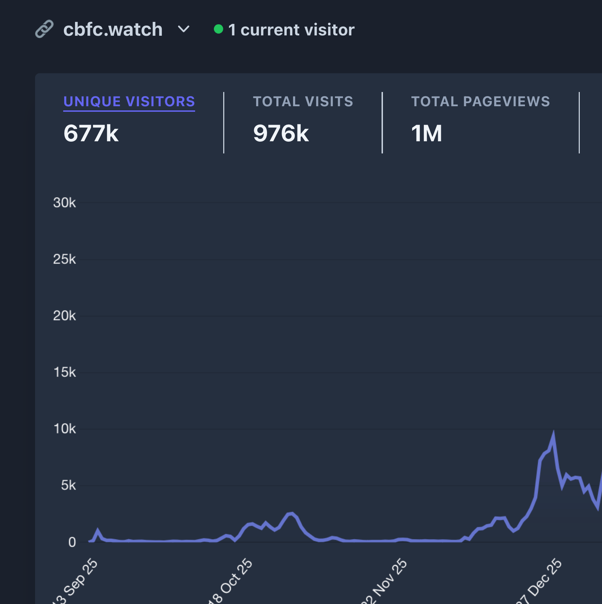{width="56%"}

<!-- slide 42 -->
## {.textcenter}

::: r-fit-text
There is more than one way to public some data.
:::

<!-- slide 43 -->
## {.textcenter}

::: r-fit-text
Who spends more time cleaning up after meals?
:::

<!-- slide 44 -->
## {background-image="attachments/odp/slide44-1.png" background-size="contain"}

<!-- slide 45 -->
## {background-image="attachments/odp/slide45-1.png" background-size="contain"}

<!-- slide 46 -->
## Spread out across multiple files and documents

{width="82%"}

<!-- slide 47 -->
## Do the work and put it into one usable file

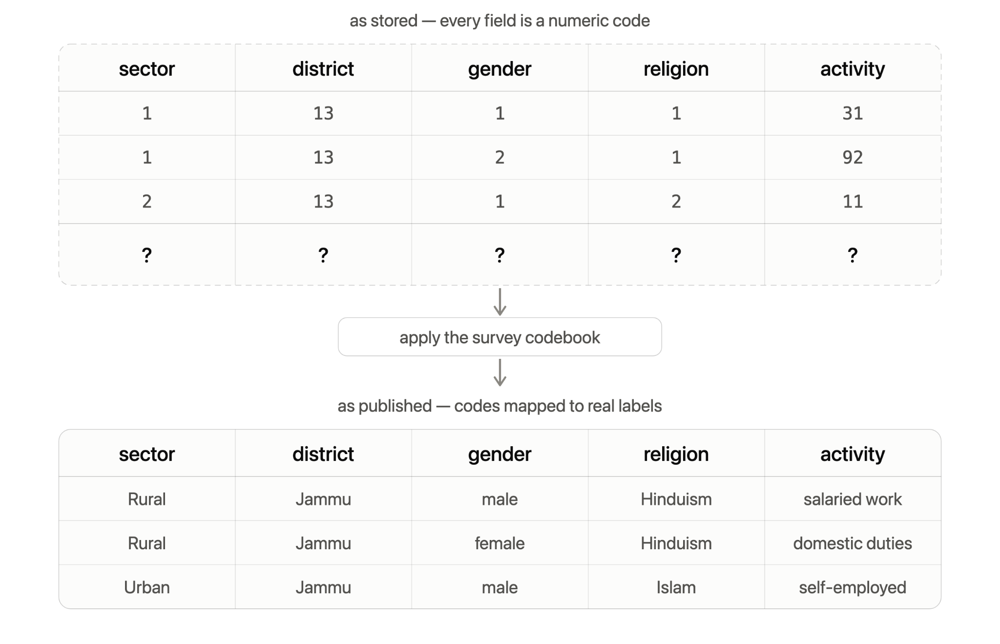{width="82%"}

<!-- slide 48 -->
## {background-image="attachments/odp/slide48-1.png" background-size="contain"}

<!-- slide 49 -->
## Run complex queries right in your browser (no server!)

{width="92%"}

<!-- slide 50 -->
## Who spends more time cleaning up after meals?

:::{.textcenter}
{width="30%"}
{width="30%"}
:::

<!-- slide 51 -->
## Share your analysis

with anyone with a link

{width="81%"}

<!-- slide 52 -->
## {background-image="attachments/odp/slide52-1.png" background-size="contain"}

<!-- slide 53 -->
## {background-image="attachments/odp/slide53-1.png" background-size="contain"}

<!-- slide 54 -->
## {.textcenter}

::: r-fit-text
What can you do for the public?
:::

<!-- slide 55 -->
## {.textcenter}

::: r-fit-text
A BI dashboard gets

users, trust, distribution by default.

With a public data interface,

You get none.
:::

<!-- slide 56 -->
## Build so things can travel outward

Maximize the surface area for shareability.

dashboard.gov.in/?filters=location

cbfc.watch/film/animal-2023

app.powerbi.com/view?r=eyJrIjoiYjU3NDc3...

:::{.textcenter}
{width="33%"}
{width="30%"}
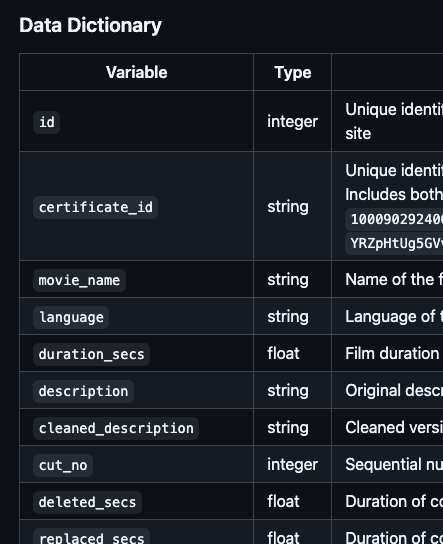{width="33%"}
:::

<!-- slide 57 -->
## Design for low friction, high delight

No login, no API key, and loads on a phone.

The barriers are already high; your interface cannot add a single one. And good lookin’!

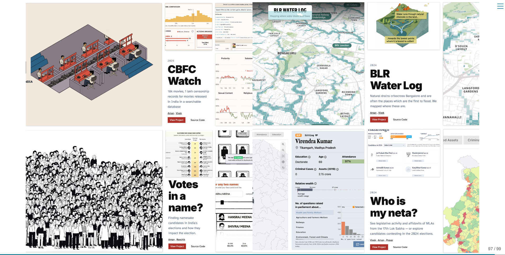{width="90%"}

<!-- slide 58 -->
## Charts are only an advertisement

Present your view, then let people explore the rest.

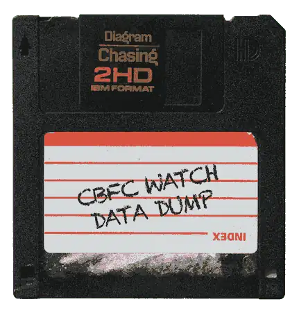{width="33%"}

<!-- slide 59 -->
## {.textcenter}

::: r-fit-text
Assume you

will lose interest

A public data interface outlives the individual interest of the person building it.
:::

<!-- slide 60 -->
## {.textcenter}

::: r-fit-text
Build so things can travel outward

Design for low friction, high delight

Charts cannot be the end point

Build for the day you lose interest
:::

<!-- slide 61 -->
## Let us build things that start something, not things where the reader stops

:::{.textcenter}
{width="60%"}
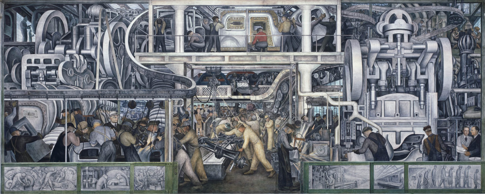{width="60%"}
:::

